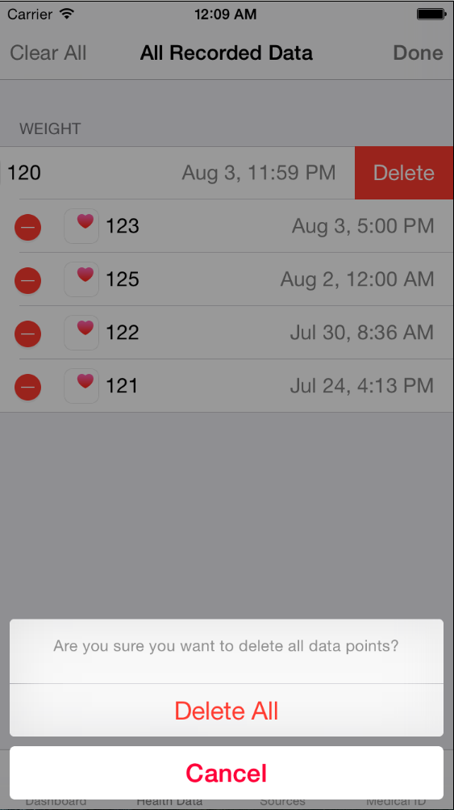

# Analysis of current system
The user has mentioned in the initial interview that he has tried a few applications related to gathering weight information; the main application that was discussed in detail was Apple's Health application for iOS.

The user remarked that, at the time of discussion, the Health application for iOS 8.1 did not give the option to set the weight unit in stones & pounds, so that is why he wanted an application that could do that.

## Apple Health (iOS 8.1)
### Screenshots and app interface
*These screenshots were obtained from the iOS Simulator - iPhone 6, iOS 8.1. All designs of this app is Apple's copyright.*

The first screenshot shows the application's initial screen once the application is loaded. This displays a holistic view of data that the user enters in the form of several separate graphs, and the user can select different time scales by the bar at the top of the window.

Moving across to the 'Health Data' view, all of the categories of the data that the user can enter is shown. This screenshot shows one of the points that the user made about an issue with this app:

> They are too complicated and have too many features for my needs - they duplicate some things such as counting of calories, for example, which I already do myself.

To get to the 'Weight' screen, the user has to tap three times to get there. The client suggested that this was too much, and hence wanted a more 'focused' app.

Once in the 'Weight' screen, there are three main points of interaction:
* The graph (yellow, top) that displays the weight points as a line chart;

* A table of weight values (in the 'Show all data' sub-menu);

* Adding a data point, under the 'Add data point' sub-menu;

Adding a new weight value was done here, and this demonstrates two issues that the user remarked:

* As before, this menu is perhaps too complex to get to - this screen is buried four menus below the main screen of the application.

* The only unit here is pounds - in the UK, this isn't used as much as in the US for weight measurement and the client suggested this with this statement:

> Many applications have units for kilograms and pounds but not the stones and pounds unit that we tend to use in this country and since there are, in my experience, no applications that do that.

These two screenshots show the graph after adding some test data. Note the different views that the user can choose that modify how the data is displayed with differing time scales.

This is the weight 'table' screen, showing all of the records with the weight value and date (as well as time) here. When I was testing this screen, I noticed a potential shortcoming:

* There is no unit displayed for each weight value;
* Deleting a record takes too many button presses.

I would try to address that in my app by:
* Adding units to weight values stored in tables;
* Make it easier to delete and manipulate records.

To delete a record, the user would have to tap three times on 'Edit', then the minus sign, then 'Delete' on each record that they want to remove. In my opinion (and the client's opinion), this is not really optimal.

There is an alert displayed when the 'Clear All' button is pressed to warn the user before deleting all of their records - I think I should include this in my app (subject to client's feedback on prototypes).

### Overall impressions
* The application is designed nicely, but in some places there are too many button presses to get to the desired actions;

* This is designed to be an 'all-in-one' application, but however both myself and the client think that there are too many things this app tries to monitor.

* This application isn't available for OS X - since my client uses their computer every day - and more than their phone, it would be more useful to have an OS X-based application rather than an iOS-based application.

### Application algorithm diagram
Based on what I have seen from this application, I've attempted to reconstruct the main processes involved with weight data collection in order to use this for my app to help it to meet the system requirements.

## Paper-based method
The client, at the moment, uses a hand-drawn table to manage their weight, in the form of this table:

| Date     | Weight (st lbs)     |
| :------------- | :------------- |
| 24/05/2015      | 11 st 6 lbs       |
| 31/05/2015      | 11 st 6 lbs       |
| 10/06/2015      | 11 st 4 lbs       |
| 16/06/2015      | 11 st 5 lbs       |
| 22/06/2015      | 11 st 4 lbs       |

The client simply writes in a new record for every time that they measure their own weight. From this, it is clear to see why the client wishes to have something like a graph in their application, so that they can easily see if they will meet their target.

As this is the main method of collecting the information at present, I think this table has to be a core component of the application, and it should be visible without too many button presses. In addition, manipulation of the data should be simple.
