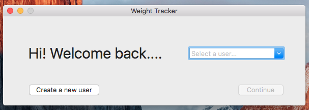
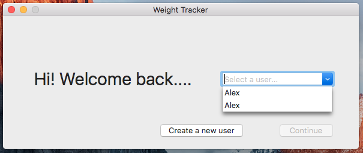

## Weight Tracker Prototype 1 Feedback Analysis
### Design changes

* Move the 'Create new user' button to the left
* Reduce white space, balance the position of objects on screen
* Change the window size to eliminate wasted white space
* In the new user window, instead of going back to the previous window after clicking Done it should move to the main window

A quick mockup of the design changes is shown here:
  

An image of the problems with the multiple users with the same name problem, with the current design:
  

