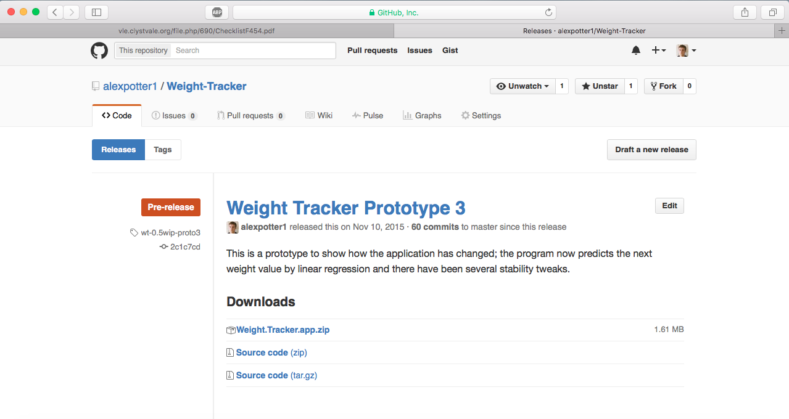
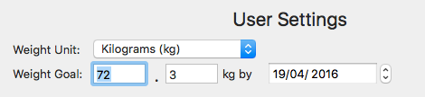
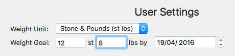
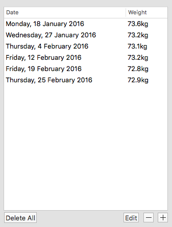
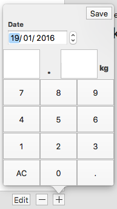
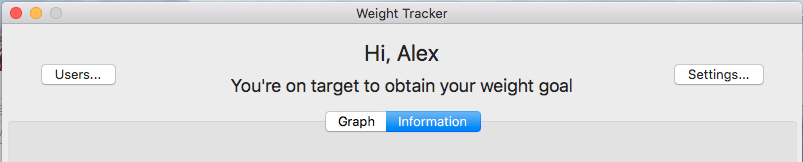
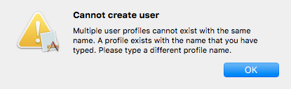
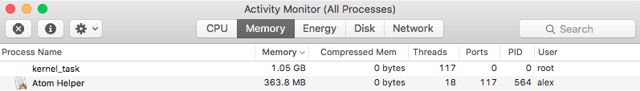
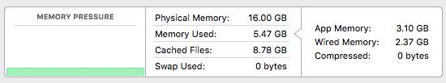
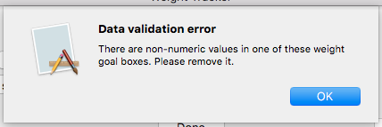

# Weight Tracker User Manual
Welcome to the user documentation for the 'Weight Tracker' application.
You can find help and information on how to use it here.
### Table of Contents
<!-- TOC depthFrom:1 depthTo:6 withLinks:1 updateOnSave:1 orderedList:0 -->

- [System Requirements](#system-requirements)
	- [Hardware Requirements](#hardware-requirements)
	- [Software Requirements](#software-requirements)
- [Getting started and installation](#getting-started-and-installation)
- [Creating a profile](#creating-a-profile)
- [Setting a weight goal](#setting-a-weight-goal)
- [Weight table actions](#weight-table-actions)
	- [Add a record](#add-a-record)
	- [Delete a record](#delete-a-record)
	- [Delete all records](#delete-all-records)
	- [Edit a record](#edit-a-record)
- [Graph](#graph)
- [Managing application data](#managing-application-data)
	- [Backup data](#backup-data)
	- [Restore data](#restore-data)
	- [Delete all data](#delete-all-data)
- [Troubleshooting](#troubleshooting)

<!-- /TOC -->


<div class="page-break"></div>

## System Requirements
#### Hardware Requirements
The *minimum* hardware requirements for this application are:
* **Intel**-based CPU
* At least **2GB** of RAM
* PCI Express-based Graphics device capable of 2D video acceleration (Quartz Extreme) such as the Intel GMA 950
* Display with at least 1024x768 resolution

The *recommended* hardware requirements are:
* Dual-core Intel Core 2 Duo 2.0GHz CPU or later
* 4GB of RAM
* ATI Radeon HD 2600 PRO graphics card (with 256MB of VRAM) or newer
* Display with a resolution of 1280x800

#### Software Requirements
The only software requirement for this application is:
* **Mac OS X Mavericks 10.9.2** or later

## Getting started and installation
To install 'Weight Tracker', you should [download it.](https://github.com/alexpotter1/Weight-Tracker/releases)
It is best to download it here as the latest versions are uploaded to this page.



Next, download the file by clicking on the **Weight.Tracker.app.zip** link, and save it to somewhere like the Desktop. It is recommended to unzip this file and move the subsequent file to the **Applications** folder, although it will work if you run it anywhere.

Double-click the application to launch it.

<div class="page-break"></div>

## Creating a profile
On the first screen that is shown, you can do the following:
* Select a profile from the dropdown list
* Create a new profile

To create a new profile, click the 'Create a new user' button to the bottom left of the window.

A new window should open, allowing you to type a name for the new profile. Then press 'Done' to save the profile.

The window will close, and you can now select the profile via the dropdown box.

<div class="page-break"></div>

## Setting a weight goal
When you first create a profile, there will be no weight goal set.

A weight goal is a weight value that you set alongside a target date that you want to achieve the particular weight value by - for example, you may want to reduce your body weight by half a stone in two months time.

The application will tell you to set a weight goal, and to set one, click the 'Settings' button in the top right of the window. A new window should open, allowing you to type a weight goal value into the second box down, as well as the date.

The weight goal box is split into two parts depending on the weight unit selected.





Type the value that you want to set into these two boxes, and then select the date that you want to set for the goal.
**NB: The date format is dd/mm/yyyy.**

Then, press Done and the weight goal will have been set.

<div class="page-break"></div>

## Weight table actions


Along the bottom of the weight table, there are four buttons to control the records that are displayed inside the table:

* Add record (+ button)
* Delete record (- button)
* Edit record
* Delete all records

#### Add a record
To add a record, simply click on the add record button underneath the table. A new window will pop-up:


By default, the date for the new weight record will be set to the current system time, but you can change that if you wish to another date.

To input a weight value, let's take the example of entering "12.6" kilograms.

* First, type 12 by pressing the numbered buttons
* Press the decimal point button (bottom right)
* Type 6 by pressing the numbered buttons
* Then press Save, and the record will be added to the table.

If you make a mistake at any time when entering the weight value, just press 'AC' (bottom left) to clear both boxes.

For the Stone & Pounds unit, the entry is very similar, except for the fact that the decimal point button is labelled 'NEXT'.

#### Delete a record
Deleting a single record is very simple - just select the record that you want to remove from the table by clicking on it once, then press the delete record button below the table.

The record will then be removed. Be careful though, as this process isn't reversible.

#### Delete all records
The 'Delete All' button is located to the far left underneath the table. To use this action, simply press the button. All the records will be removed.

Again, be careful with this, as this action can't be undone.

#### Edit a record
If you make a mistake in creating a new weight record, you can edit it by selecting the record that you want to edit in the table and then press the 'Edit' button, which is adjacent to the Delete record button.

Like the add record button, the weight entry window will pop-up again, except for the fact that now the values of the record will be already displayed in the boxes.

To replace these weight values, press 'AC' (bottom left) and you can type in a new value as the 'Add a record' section above shows.

## Graph
To access the graph, simply click on the 'Graph' tab near the top of the window. This tab button will switch between the table and the graph, so if you wish to view the weight table again, just press 'Information' which is right next to the 'Graph' button.



The graph's features aren't currently customisable at this time.

<div class="page-break"></div>

## Managing application data
This application manages data through a built-in Apple data handling interface, known as ```defaults```.
You can read from, and write to, any application's data using this interface.

The data that this program backs up includes:
* List of profiles
* Profile names
* Profile weight units
* Profile weight goals (value and date components)
* Profile weight values and dates

#### Backup data
To backup the application's stored profile data, follow these steps:

1. Close Weight Tracker, if already open by pressing Cmd-Q.
2. Open Terminal by opening the Finder, then going to Applications and then the subfolder of Utilities.
3. Once in Terminal, type the following command to backup to a file on the Desktop:
	```
	defaults export AlexPotter.Weight-Tracker ~/Desktop/weight-tracker-backup.dat
	```

	It is recommended to store this file securely and safely in external storage, such as Dropbox, Google Drive or a memory stick, as well as having multiple copies of it.

#### Restore data
To restore saved application data, follow these steps:

1. Close Weight Tracker, if already open by pressing Cmd-Q.
2. Open Terminal by opening the Finder, then going to Applications and then the subfolder of Utilities.
3. Once in Terminal, type the following command to restore the file saved. Assuming the file is on the Desktop:

	```
	defaults import AlexPotter.Weight-Tracker ~/Desktop/weight-tracker-backup.dat
	```
4. Re-open Weight Tracker and everything should be restored.

#### Delete all data
**Be careful with this, as this cannot be undone.**

If you want to delete all the saved profiles and their respective data, then you can do this:

1. Close Weight Tracker, if already open by pressing Cmd-Q.
2. Open Terminal by opening the Finder, then going to Applications and then the subfolder of Utilities.
3. Once in Terminal, type the following command to remove all saved data associated with this program:
	```
	defaults delete AlexPotter.Weight-Tracker
	```

	**NB: You don't have to delete all the data to then restore data, as the import command will replace the saved data automatically.**

## Troubleshooting
In this section, here are some common questions and answers to problems that you may have when running the application.

1. **The app keeps crashing for no reason.**

	You may be using the prototype build of this application. It is highly recommended not to use any version of this application below 1.0 as there are aspects that not only frequently change without warning, but there are also changes that could break existing functionality when moving between different prototype builds.

2. **The application is not letting me create a new user.**

	If the application displays a message like this:

	

  This issue is caused by two profiles sharing the same name. This isn't allowed in this application because otherwise, the application would have no way of knowing which profile was in use! To fix this, you have to use another name for your profile.

  If you're adamant that no other user exists with the same name, then you can delete all of the data associated with the app as described in [Delete all data](#delete-all-data).

3. **The application doesn't launch at all.**

	If you are running on a version of OS X that is earlier than 10.9 Mavericks, then this application will not function. To solve this, you will have to upgrade to at least OS X 10.9 Mavericks.

4. **The application is really slow.**

	This may have resulted from the system being low on RAM in general, or if the system is under high CPU load. To check this, launch Finder and navigate to Applications/Utilities and open Activity Monitor.

  The RAM usage is displayed under the Memory tab, with the highest-consuming applications displayed at the top.

  Under normal circumstances, Weight Tracker should not use more than 50MB of RAM at the most. However, if Weight Tracker is displayed at the top of the list and is using an excessive amount, press the 'X' icon in the top left and click 'Force Quit' to close the application so that you can restart it, as shown in this picture:
  

  At the bottom of Activity Monitor, you will see a summary of RAM like this:
  

  If the memory pressure is not green but orange or red, and the RAM in use is close to the system RAM capacity, then you may want to consider closing some applications or upgrading the system RAM.

  At the very least, **2GB** of RAM is sufficient for this application, with **4GB** being the recommended amount.

5. **The application has stopped responding.**

	If the application seems to hang or you see this instead of the mouse pointer:

  

  You can attempt to press Cmd-Q to quit the application. If that doesn't work, click the Apple menu in the top left of the screen, click 'Force Quit' (or press the keyboard shortcut Cmd-Option-Esc) and then quit Weight Tracker that way.

6. **I have a Non-numeric weight goal error?**

	If you see this screen when you type a value into the weight goal box in Settings:
	

	You have probably entered a letter instead of a number in one, or both, of the weight goal boxes. Because letters are not convertible to numbers, this would cause problems with the weight calculations so only numeric values are allowed. 												    		

	To solve this, just remove any letters/other characters that exist here.
