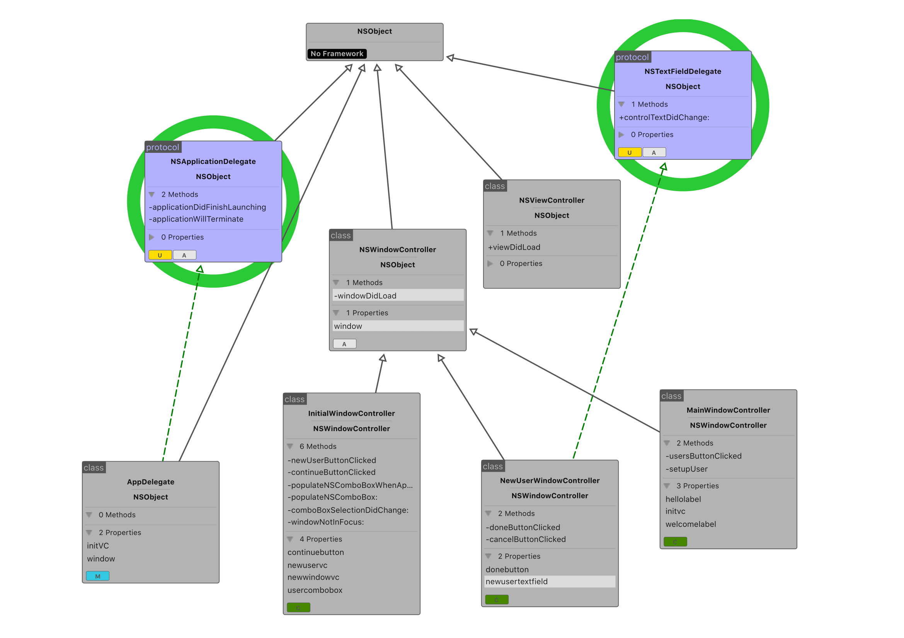
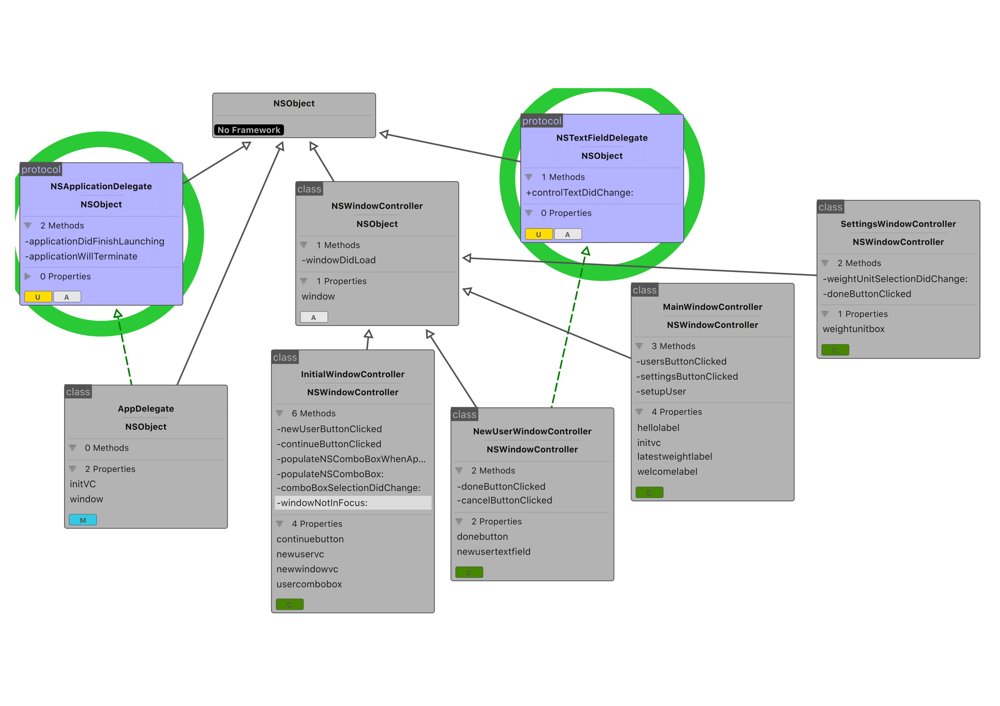
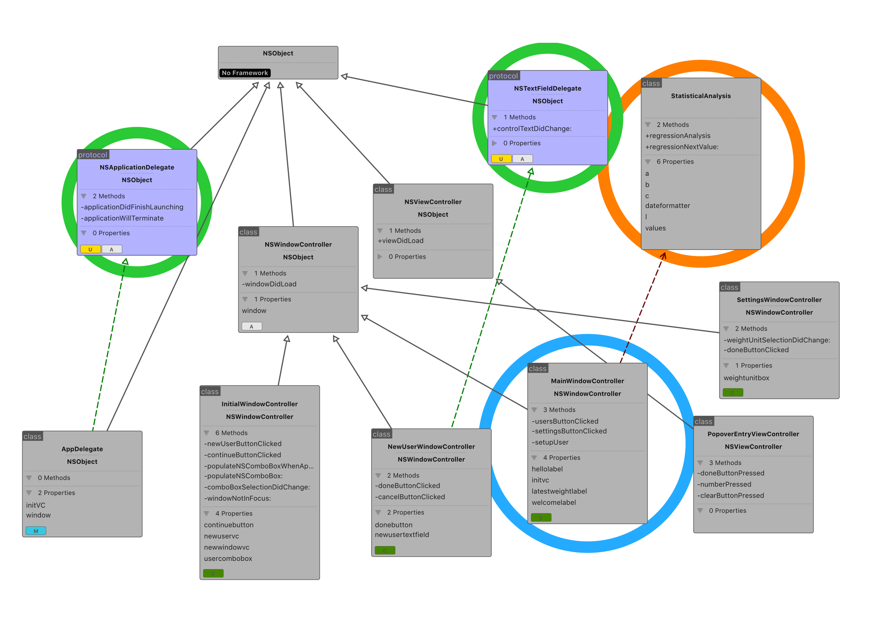
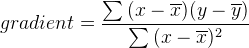
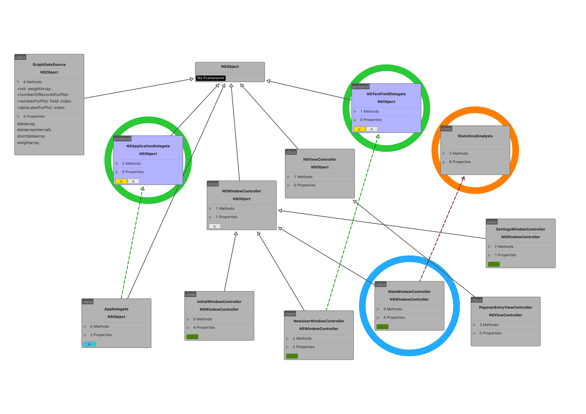

## Algorithm Design

### Initial stages

Firstly, I decided to break down the logic of the application into these separate, distinct actions that would form the basis of the program's interaction with the client.
In reality, the pseudo-code won't be implemented in exact form as user interface objects - for example - connect via outlets and other connections that can't exactly be expressed in a framework-neutral format.

* Initialise/create new user
* Select user from list
* Load the main window

The UML diagram for the planned implementations at this stage is:


#### Initialising a new user
*Algorithm 1*
Pseudo-code:
```
VOID FUNCTION newUser(sender) {
  IF sender == New user button clicked {
    LOAD NewUser window;

    INPUT user_name;
    LOAD user array from persistent storage from key "NewUserNames" as user_array;
    IF user_array doesn't exist {
      user_array = new Array[];
      APPEND user_name to user_array;
      SAVE user_array to persistent storage;
    }

    IF user_name exists in user_array {
      LOAD alert window;
    } ELSE {
      CREATE user_info dictionary;
      SAVE user_info to persistent storage for key '"profileInfo" +(user_name)'";
    }

    CLOSE NewUser window;
  }
}

```

#### Select user from list
When the window loads, the list of profiles has to be populated from the persistent storage. Then, the user can select their profile. Both of these actions would exist in two functions.

In the first function that handles the population of profiles, the last object in the profile name list is added to avoid duplicates. This works even when the the application is launched for the first time, as this function runs every time the profile selection window comes into focus, so only one profile is ever added to the list at once.

The second function is called whenever the user clicks on a profile in the box, so therefore the class containing this function **must** be a *delegate* of the ```NSComboBox``` (profile selection box object) type.

*Algorithm 2*
Pseudo-code:
```
VOID FUNCTION populateProfileBox() {
  user_names = LOAD user name array from persistent storage from key "NewUserNames";
  user_names_length = length of user_names array;
  ADD user_names[user_names_length] to profile drop-down box;
}
```

```
VOID FUNCTION profileBoxSelectionDidChange() {
  user_name = Currently selected value from profile selection box;
  SAVE user_name to persistent storage for key "currentUser";
}
```

#### Load main window
*Algorithm 3*
Pseudo-code:
```
VOID FUNCTION loadMainWindow(sender) {
  selected_user = STRING(Selected value of User Selection box);

  IF sender == Continue button clicked {
    LOAD MainWindow;

    DISPLAY "Hi, " + (selected_user);

    LOAD user info dictionary from persistent storage from key '"profileInfo" + (selected_user)' as user_info;
    LOAD weight unit from user_info from key "weightUnit" as weight_unit;
    LOAD weight goal array from user_info from key "weightGoal" as weight_goal;

    LOAD weight values array from user_info from key "weightValues" as weight_values;
    LOAD weight dates array from user_info from key "weightDates" as weight_dates;

    RELOAD weight table data

    weight_goal_value = weight_goal[0]
    weight_goal_date = weight_goal[1]

    IF weight_unit == "st lbs" {
      components = new Array[];
      components = SPLIT weight_goal_value BY DELIMITER ".";
      DISPLAY (components[0]) + "st" + (components[1]) + "lbs" + "by " + (weight_goal_date)
    } ELSE {
      DISPLAY (components[0]) + (weight_unit) + "by " + (weight_goal_date)
    }

    IF weight_goal_date is nil or doesn't exist {
      DISPLAY "No weight goal set";
    }

    ExpectedWeight(dateArray=weight_dates, weightArray=weight_values);


  }
}
```

### Cycle 2
In the second cycle, I would start to add the Settings window and a window back to the user menu. These actions would have to be implemented - not only the button presses, but the initialisation of the new window, etc.

* Load settings window
* Settings - Get weight goal value that user types
* Settings - Done button
* Settings - Delete User
* Settings - Get weight unit value from menu box
* Load user menu

The UML diagram for the planned implementations at this stage is:

#### Load settings window
*Algorithm 4*
Pseudo-code:
```
VOID FUNCTION loadSettings(sender, selected_user) {
  IF sender == Settings button in Main Window {
    LOAD Settings window;

    LOAD user info dictionary from persistent storage from key '"profileInfo +" (selected_user)' as user_info;
    LOAD weight unit from user_info from key "weightUnit" as weight_unit;
    LOAD weight goal array from user_info from key "weightGoal" as weight_goal_array;

    weight_goal_value = weight_goal_array[0];
    weight_goal_date = weight_goal_array[1];

    IF weight_unit == "kg" {
      SELECT item "Kilograms (kg)" in weight unit selection box;
    } ELSE IF weight_unit == "lbs" {
      SELECT item "Pounds (lbs)" in weight unit selection box;
    } ELSE {
      SELECT item "Stone & Pounds (st lbs)" in weight unit selection box;
    }

    SET weight goal box to value of weight_goal_value;
    SET weight goal date box to value of weight_goal_date;

  }
}
```

#### Settings - Get weight goal value that user types
*Algorithm 5*
Pseudo-code:
```
VOID FUNCTION weightGoalTextDidChange() {
  weight_goal_value = ""
  WHILE user is interacting with weight goal box {
    weight_goal_value = text box contents;
  }
}
```

#### Settings - Done button
*Algorithm 6*
Pseudo-code:
Here, variables such as ```user_info``` and ```weight_goal_value``` are stored as class variables for the SettingsWindowController class - so they are able to be used by all of the functions of the class even though they haven't been explicitly defined in this function for example.
```
VOID FUNCTION DoneButtonClicked(sender) {
  LOAD user's name from persistent storage from key "currentUser" as user_name;

  IF sender == Settings window Done button {
    IF weight_goal_value != "0.0" {
      weight_goal_array = new Array[];
      FORMAT weight_goal_date in human-readable format;

      weight_goal_array[0] = weight_goal_value;
      weight_goal_array[1] = weight_goal_date;   
    }

    REPLACE object in user_info at key "weightGoal" with weight_goal_array;
    REPLACE object in user_info at key "weightUnit" with weight_unit;

    SAVE user_info to persistent storage for key '"profileInfo + " (user_name)';

    CLOSE Settings window;
  }
}
```

#### Settings - Delete user
*Algorithm 7*
Pseudo-code:
```
VOID FUNCTION DeleteUserButtonClicked(sender) {
  if sender == Settings window Delete user button {
    alert = new Alert Window
    alert headline = "Are you sure?"
    alert message = "This action can't be undone"
    alert addButton("OK")
    alert addButton("Cancel")

    LOAD alert Window

    IF user clicks alert "OK" button {
      user_name_array = LOAD user name array from persistent storage from key "NewUserNames";
      user_name = LOAD current user name from persistent storage from key "currentUser";

      TRY {
        REMOVE user_name from user_name_array;
      } CATCH {
        ERROR user_name is not in user_name_array;
      }

      SAVE user_name_array to persistent storage for key "NewUserNames";
      CLOSE Settings window
      CLOSE Main window
      LOAD Initial window (user selection window)

    } ELSE {
      CLOSE alert window
    }
  }
}
```

#### Settings - Get weight unit value from menu box
In the Settings window, there is a box that the user can use to help them select a unit to measure their weight in - Kilograms, Pounds and "Stone & Pounds" are the possible selections.
This function retrieves this value from the menu box object and saves it in the userInfo dictionary so that it can be stored persistently, but also being linked to the user's profile.
This would also be called every time the selected item in the menu box changes - so in practice, the class containing this function will act as the *delegate* for the menu box object so that this function can be called on behalf of the UI object.

*Algorithm 8*
Pseudo-code:
```
VOID FUNCTION weightUnitSelectionDidChange() {
  selected_item = Weight Unit box selected item;
  user_name = LOAD current user name from persistent storage from key "currentUser";
  user_info = LOAD user information dictionary from persistent storage from key '"profileInfo" + (user_name)';

  IF selected_item != NIL {
    IF selected_item == "Kilograms (kg)" {
      REPLACE object in user_info dictionary for key "weightUnit" with "kg";
      DISPLAY "kg" as weight goal label text;

    } ELSE IF selected_item == "Pounds (lbs)" {
      REPLACE object in user_info dictionary for key "weightUnit" with "lbs";
      DISPLAY "lbs" as weight goal label text;

    } ELSE IF selected_item == "Stone & Pounds (st lbs)" {
      REPLACE object in user_info dictionary for key "weightUnit" with "st lbs";
      DISPLAY "st lbs" as weight goal label text;

    } ELSE {
      BREAK;
    }

    SAVE user_info to persistent storage for key '"profileInfo" + (user_name)';
  }
}
```

#### Load user menu
In this cycle, the design was modified to add a 'Users' button to the top-left of the application, so that the user can go back and select a different profile if they want.

*Algorithm 9*
Pseudo-code:
```
VOID FUNCTION loadUserSelectionScreen(sender) {
  IF sender == Users button {
    LOAD initial window;

    InitialWindow.populateProfileBox();

    CLOSE main window;
  }
}
```

### Cycle 3
In this cycle, code for the weight table would be added, along with a weight goal label on the main window screen alongside an 'Expected weight' label.
The user can use the add buttons and delete buttons to modify data in the table.

The following algorithms would be implemented in this cycle:
* Weight table code (add record, delete record, update table data)
* Calculate expected weight and display expected weight

The UML diagram for the planned implementations at this stage is:


#### Weight table - display table data
These following algorithms contained in the class of the main window will instruct and give data to the table view so that it can be displayed in an effective way to the user.
The first one calculates the number of data records that the table will have to display, by returning the number of items in the profile's weight value array; the second one gives the actual data to the table depending on whether the table is displaying for the *date* column or the *weight* column.

As with some other functions, these functions would be **called automatically by the table view** therefore the class must be marked this time as both the *data source* and *delegate* of the ```NSTableView```.

As these are external functions that are being overridden here, the basic purpose of these functions can be seen in further detail in Apple's framework reference documentation at:
 https://developer.apple.com/library/mac/documentation/Cocoa/Reference/ApplicationKit/Protocols/NSTableDataSource_Protocol/
 and:
 https://developer.apple.com/library/mac/documentation/Cocoa/Reference/NSTableViewDelegate_Protocol/#//apple_ref/occ/intfm/NSTableViewDelegate

*Algorithm 10*
Pseudo-code:
```
INT FUNCTION numberOfRowsInTableView(tableView) {
  user_name = LOAD user info dictionary from persistent storage from key "currentUser";
  user_info = LOAD user info dictionary from persistent storage from key '"profileInfo" + (user_name)';

  weight_value_array = LOAD from user_info the mutable object for key "weightValues";
  weight_date_array = LOAD from user_info the mutable object for key "weightValueDates";

  weight_unit = LOAD from user_info the object for key "weightUnit";

  IF LENGTH of weight_value_array != 0 {
    return LENGTH of weight_value_array;
  }
}
```

*Algorithm 11*
Pseudo-code:
```
VOID FUNCTION tableView(tableView, tableColumn, row) {
  tableCellView = Make a new table view with the identifier of the column being processed;

  user_name = LOAD user info dictionary from persistent storage from key "currentUser";
  user_info = LOAD user info dictionary from persistent storage from key '"profileInfo" + (user_name)';
  weight_value_array = LOAD from user_info the mutable object for key "weightValues";
  weight_date_array = LOAD from user_info the mutable object for key "weightValueDates";
  weight_unit = LOAD from user_info the object for key "weightUnit";

  IF the table column identifier == "weightDates" { // set when creating the interface
    date = weight_date_array[row];
    SET text value of tableCellView equal to date;
  }

  IF the table column identifier == "weightValues" {
    weight = weight_value_array[row];

    SET text value of tableCellView equal to weight concatenated with weight_unit;
  }

}
```

#### Weight table - add record
This algorithm would be initiated by the user clicking on the button to add a new record to the table. This would require another class to handle the input to meet the requirement of the user wishing to have a 'keypad'-like entry interface - so that class would handle the weight input and return it back to the main window so that it can be displayed in the table.

**profileName** and **profileInfo** are class variables so they can be used by all the functions below that are needed to carry out this task.

*Algorithm 12*
Pseudo-code:
```
VOID FUNCTION WeightTableAddButtonClicked(sender) {
  IF sender == Weight table add button {
    LOAD weight entry screen;

    profileName = LOAD user profile name from persistent storage from key "currentUser";
    profileInfo = LOAD user information from persistent storage from key '"profileInfo" + (profileName)';
  }
}
```

In addition, there would also be another function to handle the buttons being pressed as the user inputs the data, and adds the value of the button to the displayed weight value (as a String) in the box:
*Algorithm 13*
Pseudo-code:
```
VOID FUNCTION numberPressed(sender) {
  number = title of sender (button that was clicked);
  IF Weight entry box string value == "" {
    Weight entry box string value = number;
  } ELSE {
    APPEND number to weight entry box string value;
  }

}
```

Furthermore, there would be buttons to handle the 'Clear' and 'Done' buttons respectively:
*Algorithm 14*
Pseudo-code:
```
VOID FUNCTION ClearButtonPressed(sender) {
  IF sender == Clear button {
    Weight entry box string value = "";
  }
}
```

*Algorithm 15*
Pseudo-code:
```
VOID FUNCTION DoneButtonPressed(sender) {
  IF sender == Done button {
    IF the Weight entry box isn't empty {
      weight_array = LOAD weight value arrays from profileInfo dictionary from key "weightValues";
      weight_date_array = LOAD weight date arrays from profileInfo dictionary from key "weightValueDates";

      date = Get current system date in human-readable format;

      APPEND Weight entry box string value to weight_array;
      APPEND date to weight_date_array;

      REPLACE weight_array to profileInfo dictionary for key "weightValues";
      REPLACE weight_date_array to profileInfo dictionary for key "weightValueDates";

      SAVE profileInfo dictionary to persistent storage for key '"profileInfo" + (profileName)' ;

      CLOSE Weight entry window;

      Update weight table in Main window class;
    }
  }
}
```

#### Weight table - Delete record
Another button would be added according to the design of the main window at this stage - underneath the table itself.
This would serve a simple purpose of allowing the user to click on the record that they want to delete and click the button, then the record is removed from the table and the storage database.

*Algorithm 16*
Pseudo-code:
```
VOID FUNCTION WeightTableDeleteButtonClicked(sender) {
  IF sender == Weight table delete button {
    IF the number of selected rows in the weight table != 0 {
      rowIndex = selected row of weight table;
      REMOVE row at index 'rowIndex' of weight table;
    }
  }
}
```

#### Expected weight
In this cycle, I plan to implement a function first called in *Algorithm 3*.
This takes the entire weight and date arrays and performs calculations on the data to get a prediction value that can be displayed.

Originally, I decided to use percentage difference to calculate the expected weight.
*Algorithm 17*
Pseudo-code:
```
VOID FUNCTION ExpectedWeight(dateArray, weightArray) {
  timeDelta = 0.0;
  weightDelta = 0.0;

  IF count of weightArray or dateArray is less than 2 {
    Expected weight label string value = "Not enough weight values yet...";
  } ELSE IF count of weightArray mod 2 == 0 {
    FOR (i=0, i <= dateArray count divided by 2, i++) {
      timeDelta += CalculateTimeDelta(date1=dateArray[i], date2=dateArray[i+1]);
    }
  }
}
```

And the CalculateTimeDelta and CalculateWeightDelta functions:
*Algorithm 18*
Pseudo-code:
```
DOUBLE FUNCTION CalculateTimeDelta(date1, date2) {
  Convert date1, date2 from human readable dates into timestamps
  timeDelta = abs(date2-date1)
  RETURN timeDelta
}
```

*Algorithm 19*
The percentage difference formula is ```( |Value1 - Value2| / [](Value1 + Value2)/2]) * 100 ```
Pseudo-code:
```
DOUBLE FUNCTION CalculateWeightDelta(weight1, weight2) {
  difference = weight2 - weight1;
  average = (weight1 + weight2) / 2;

  RETURN (difference/average) * 100;
}
```

However, I soon found out that this method didn't give accurate results, as discussed in the *Software Development* log.
I changed this prediction algorithm to use linear regression, whilst also giving it its own class to function within.

The ExpectedWeight function was subsequently changed.
*Algorithm 17 - modified*
Pseudo-code:
```
VOID FUNCTION ExpectedWeight(dateArray, weightArray) {
  statistics = StatisticalAnalysis(date_Array=dateArray, weight_Array=weightArray);
  statistics.RegressionAnalysis();
  statistics.RegressionNextValue(time interval in one week);

  DISPLAY expected weight in one week on Main window;
}
```

The new class, named StatisticalAnalysis, was then created, as well as the function to handle the regression calculations.
The weight and date values are stored in an array of tuples known as ```values```.

This function uses linear regression to predict the next weight value - the expression to find the gradient for the regression line is shown below.
In this expression, x is defined as the dates and y is defined as the weight information.



*dateMean*, *weightMean*, *gradient* and *intercept* are all class variables here.

*Algorithm 18*
Pseudo-code:
```
VOID FUNCTION RegressionAnalysis() {
  dateMean = (sum of date values in dateArray) / (number of values in weightArray);
  weightMean = (sum of weight values in weightArray) / (number of values in weightArray);

  top = 0;
  bottom = 0;

  FOR (i, j) IN values {
    top += (i - dateMean) * (j - weightMean);
    bottom += (i - dateMean) squared;
  }

  gradient = top / bottom;
  intercept = weightMean - (gradient * dateMean);
}
```

And since the function above calculates a straight line corresponding to the data points in the table, the next value for a particular time period can be calculated with another function in the StatisticalAnalysis class.

*Algorithm 19*
Pseudo-code:
```
DOUBLE FUNCTION RegressionNextValue(date) {
  // y = mx + c; y = weight at particular date
  RETURN (gradient * date) + intercept;
}
```

### Cycle 4
In this cycle, the graph is the last major function to be implemented. In addition, upon user feedback, there was a request for 'Delete All' and 'Edit' buttons on the weight table.

Therefore, the following algorithms will be implemented in this cycle:
* Delete all weight table records
* Edit selected weight table record
* Initialise and display graph
* Validation of weight goal value

The UML diagram at this stage is shown, with the ```GraphDataSource``` class the only new class to be implemented:


#### Delete All - Weight table
As the name suggests, this algorithm needs to take all of the records in the weight table and delete them, removing them from the view as well as removing them from the persistent storage database.

*Algorithm 20*
Pseudo-code:
```
VOID FUNCTION WeightTableDeleteAllButtonClicked(sender) {
  IF sender == Weight table 'Delete All' button {
    IF number of rows in weight table != 0 {
      Indexes = number of rows in weight table;
      REMOVE weight table rows at index=Indexes;
    }
  }
}
```

#### Edit record - Weight table
For this algorithm, I would probably need to modify the weight entry class to not just allow for adding a record but also to modify the currently selected one.

*Algorithm 21*
Pseudo-code:
```
VOID FUNCTION WeightTableEditButtonClicked(sender) {
  IF sender == weight table edit button {
    user_name = LOAD current user name from persistent storage from key "currentUser";
    user_info = LOAD user info dictionary from persistent storage from key '"profileInfo" + (user_name)';
    weight_value_array = LOAD weight values from user_info dictionary from key "weightValues";
    weight_date_array = LOAD weight dates from user_info dictionary from key "weightValueDates";

    selectedIndex = selected row of weight table;

    IF (selectedIndex < length of weight_value_array) AND (selectedIndex < length of weight_date_array) {
      recordWeight = weight_value_array[selectedIndex];
      recordDate = weight_date_array[selectedIndex];


      LOAD weight entry screen;
    }
  }
}
```

In addition, a new function would need to be added to the weight entry window class to allow it to handle editing a record, so that it can load the weight and date values into the window for that record but also to allow replacing the record's data at the index of the record in both arrays, rather than just adding another item to both arrays.

*EditableRecord* and *EditableWeight* are class variables used so that the ```DoneButtonPressed``` function can handle the additional case of editing a record.

*Algorithm 22*
Pseudo-code:
```
VOID FUNCTION EditRecord(editableWeight, editableDate) {
  EditableWeight = editableWeight;
  DISPLAY editableWeight in weight entry box;
  DISPLAY editableDate in date picker box;

  EditableRecord = true
}

```

*Algorithm 15 - modified*
```
VOID FUNCTION DoneButtonPressed(sender) {
  IF sender == Done button {
    IF the Weight entry box isn't empty {
      weight_array = LOAD weight value arrays from profileInfo dictionary from key "weightValues";
      weight_date_array = LOAD weight date arrays from profileInfo dictionary from key "weightValueDates";

      date = Get current system date in human-readable format;

      IF EditableRecord == FALSE {
        APPEND Weight entry box string value to weight_array;
        APPEND date to weight_date_array;
      } ELSE {
        matchingIndex = 0;
        FOR (i=0, i <= weight_array length, i++) {
          IF weight_array[i] == EditableWeight {
            matchingIndex = i;
          }
        }

        REPLACE weight value at index i in weight_array with new weight entry box value;
        REPLACE date value at index i in weight_date_array with new date value;

      }

      REPLACE weight_array to profileInfo dictionary for key "weightValues";
      REPLACE weight_date_array to profileInfo dictionary for key "weightValueDates";

      SAVE profileInfo dictionary to persistent storage for key '"profileInfo" + (profileName)' ;

      CLOSE Weight entry window;

      Update weight table in Main window class;
    }
  }
}
```

#### Graph
In the design, there is two tabs - one labelled "Information" and the other labelled "Graph". First of all, I would need a function that detects when the user clicks on a tab so that the graph can be loaded on its separate tab.

Like before, the ```tabView``` function is part of the ```NSTabViewDelegate``` protocol this time, so the main window class **must** be a *delegate* of the tab view to capture the button press.

*Algorithm 23*
Pseudo-code:
```
VOID FUNCTION tabView(tabView, tabViewItem) {
  IF tabViewItemIdentifier == the graph tab identifier {
    updateGraph();
  }
}

```

The ```updateGraph``` function in the main window class actually performs the initialisation of the graph, as well as updating it. This is called each time the user clicks on the graph tab so that the newest values are obtained from the arrays.

*Algorithm 24*
Pseudo-code:
```
VOID FUNCTION updateGraph() {
  user_name = LOAD user name from persistent storage from key "currentUser";
  user_info = LOAD user info dictionary from persistent storage from key '"profileInfo" + (user_name)'

  graph = new CorePlotGraph(frame=graph view bounds);
  graph padding = 0;
  graph title font = "Helvetica Neue Light";
  graph axis title font = "Helvetica Neue Bold";

  graph x-axis title = "date";
  graph x-axis label = None;

  graph y-axis title = "weight";
  graph y-axis label = None;

  graph title = "Weight Graph";

  scatterPlot = new CorePlotScatterPlot(frame=graph view bounds);
  scatterPlot setDataSource = SELF

  graph addPlot(scatterPlot)

  graph disable user interaction = TRUE

}

```

#### Validation of weight goal value
This would need to be implemented to prevent non-alphanumeric characters forming the weight goal value - as this can cause garbage values to be output for some of the calculations.

This algorithm attempts to cast each weight value for each box to an integer from a string - if this fails (by the casted values being a NULL value), then present the error message. If not, save the value to the array as normal.

The way that this would be accomplished would be to display an alert or error message when the user enters any character that isn't a number.

This involves modifying *Algorithm 5*, so that each character when typed in can be checked individually.
*Algorithm 5 - modified*

Pseudo-code:
```
VOID FUNCTION weightGoalTextDidChange() {
  majorWeightValue = CONVERT Weight goal major box value from String to Int;
  minorWeightValue = CONVERT Weight goal minor box value from String to Int;

  IF (majorWeightValue == nil) || (minorWeightValue == nil) {
    alert = new Alert();
    alert title = "Data validation error"
    alert message = "You've probably typed a non-numeric character in one of the boxes. Please remove it."
    alert addButton("OK")
    DISPLAY alert;
  } ELSE {
    concatenatedWeightGoal = (CONVERT majorWeightValue to String) + (CONVERT minorWeightValue to String);
    SAVE concatenatedWeightGoal to weight goal array;
  }
}
```
