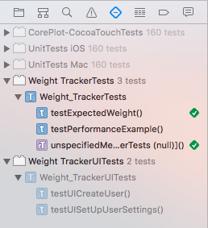

# Test Plan

Afterwards, in order to test the program post-development, I propose to test the following
parts of the program to make sure that:

* There are as few bugs as possible in the final versions of the program
* The program functions correctly in the scope of the design, and requirement specifications.

The test plan will contain all of the tests that will be run after each cycle, as well as whether each test passes in the debug environment (my computer, OS X 10.11 El Capitan) and the target environment (client's computer, OS X 10.9 Mavericks).

## Cycle 1
### Initial design of Test Plan
| Aspect to be tested | Module | Comments | Pass/Fail (debug) | Pass/Fail (target) |
| :------------- | :------------- | :----------- | :------- | :-------- |
| Application launches and first window opens | AppDelegate/NSApplication (UNIX exec()) | This test checks that the application runs on the target machine | N/A | N/A |
| Create new user button loads new user window | InitialWindowController/NewUserWindowController | This test checks that the 'Create new user' button loads the new user window | N/A | N/A |
| User name validation - Normal | NewUserWindowController | This test checks that the user name is set as "Alex123". This test uses only alphanumeric characters. | N/A | N/A |
| User name validation - Invalid | NewUserWindowController | This test checks if a new user will be created with the same name as another user/profile (Passes if validation works) | N/A | N/A |
| User name validation - Extreme | NewUserWindowController | This test checks if these non-alphanumeric Unicode characters (U+26F1 ⛱, U+26F3 ⛳, U+26F5 ⛵) are accepted as a user name. | N/A | N/A |
| Selection of user profiles | InitialWindowController/MainWindowController | This test checks whether the correct profile is loaded when selected. | N/A | N/A |

## Alpha/Beta test
**Note: If a test fails that is integral to the program's execution flow, the remaining tests in the plan are skipped.**

| Aspect to be tested | Module | Comments | Pass/Fail (debug) | Pass/Fail (target) |
| :------------- | :------------- | :----------- | :------- | :-------- |
| Application launches and first window opens | AppDelegate/NSApplication (UNIX exec()) | This test checks that the application runs on the target machine | Pass | **Fail** |
| Create new user button loads new user window | InitialWindowController/NewUserWindowController | This test checks that the 'Create new user' button loads the new user window | Pass | -- |
| User name validation - Normal | NewUserWindowController | This test checks that the user name is set as "Alex123". This test uses only alphanumeric characters. | **Fail** | -- |
| User name validation - Invalid | NewUserWindowController | This test checks if a new user will be created with the same name as another user/profile (Passes if validation works) | -- | -- |
| User name validation - Extreme | NewUserWindowController | This test checks if these non-alphanumeric Unicode characters (U+26F1 ⛱, U+26F3 ⛳, U+26F5 ⛵) are accepted as a user name. | -- | -- |
| Selection of user profiles | InitialWindowController/MainWindowController | This test checks whether the correct profile is loaded when selected. | -- | -- |

In this testing phase, all the tests in the plan failed on the target because I had decided (provisionally) to use a 'storyboard' for creating the interface - OS X Mavericks does not support 'storyboard'-based UI design and the application simply crashes when launching. I had to resort to the legacy 'XIB'-based UI design method, which would now work perfectly.

#### Alpha/Beta test 1 (re-run)
After changing the application, I re-ran Alpha test 1:

| Aspect to be tested | Module | Comments | Pass/Fail (debug) | Pass/Fail (target) |
| :------------- | :------------- | :----------- | :------- | :-------- |
| Application launches and first window opens | AppDelegate/NSApplication (UNIX exec()) | This test checks that the application runs on the target machine | Pass | Pass |
| Create new user button loads new user window | InitialWindowController/NewUserWindowController | This test checks that the 'Create new user' button loads the new user window | Pass | Pass |
| User name validation - Normal | NewUserWindowController | This test checks that the user name is set as "Alex123". This test uses only alphanumeric characters. | Pass | Pass |
| User name validation - Invalid | NewUserWindowController | This test checks if a new user will be created with the same name as another user/profile (Passes if validation works) | Pass | Pass |
| User name validation - Extreme | NewUserWindowController | This test checks if these non-alphanumeric Unicode characters (U+26F1 ⛱, U+26F3 ⛳, U+26F5 ⛵) are accepted as a user name. | Pass | Pass |
| Selection of user profiles | InitialWindowController/MainWindowController | This test checks whether the correct profile is loaded when selected. | Pass | Pass |

## Cycle 2
### Test Plan Extension
| Aspect to be tested | Module | Comments | Pass/Fail (debug) | Pass/Fail (target) |
| :------- | :------- | :------- | :------ | :--------|
| Setting a weight goal | SettingsWindowController | This test checks whether the weight goal value and date can be entered properly and are stored properly. | N/A | N/A |
| Setting weight unit | SettingsWindowController | This test checks if the user can select all three weight units without any problems. | N/A | N/A |
| Deleting user | SettingsWindowController | This test checks if the user can delete their profile without errors. | N/A | N/A |

### Alpha/Beta test 2

| Aspect to be tested | Module | Comments | Pass/Fail (debug) | Pass/Fail (target) |
| :------- | :------- | :------- | :------ | :--------|
| Setting a weight goal | SettingsWindowController | This test checks whether the weight goal value and date can be entered properly and are stored properly. | Pass | **Fail** |
| Setting weight unit | SettingsWindowController | This test checks if the user can select all three weight units without any problems. | Pass | Pass |
| Deleting user | SettingsWindowController | This test checks if the user can delete their profile without errors. | Pass | Pass |

### App crash 1
* The first application crash was when setting the weight goal:

This is due to the program determining the weight value (when stones and pounds weight unit is selected) by using the decimal point to break the weight value down into the "stones" and "pounds" values respectively by using an array.
If the user doesn't enter a decimal point, then there is only one value in this array, not two, and the code runs into an out-of-bounds error. In addition, this also makes the profile permanently inaccessible to the user.

  To fix this, I would need to:
  * Either create an alternative interface when the "st lbs" unit is selected
  * To perform some data validation on the text field to only allow values containing a decimal point to be entered.

## Cycle 3
### Test Plan Extension 2

| Aspect to be tested | Module | Comments | Pass/Fail (debug) | Pass/Fail (target) |
| :------- | :------- | :------- | :------- | :------- |
| Add weight value | MainWindowController/PopoverEntryViewController | This test checks if the 'add weight value' button works and that the value and date are displayed properly in the table. | N/A | N/A |
| Remove selected weight value | MainWindowController | This test checks if the table can handle a random selected record being removed without error. | N/A | N/A |
| Expected weight | MainWindowController/StatisticalAnalysis | This test checks whether the expected weight calculation functions and displays correctly | N/A | N/A |

### Alpha/Beta test 3
| Aspect to be tested | Module | Comments | Pass/Fail (debug) | Pass/Fail (target) |
| :------- | :------- | :------- | :------- | :------- |
| Add weight value | MainWindowController/PopoverEntryViewController | This test checks if the 'add weight value' button works and that the value and date are displayed properly in the table. | Pass | Pass |
| Remove selected weight value | MainWindowController | This test checks if the table can handle a random selected record being removed without error. | Pass | Pass |
| Expected weight | MainWindowController/StatisticalAnalysis | This test checks whether the expected weight calculation functions and displays correctly | Pass | Pass |

##### Unit test of expected weight algorithm
I decided to use a unit test to check that the expected weight algorithm (StatisticalAnalysis class) functions as expected.

I was able to do this by checking that the output of the algorithm is the same as the output from a Casio FX-991ES Plus calculator, which is able to perform linear regression calculations and had the same data input into it.

The test code was implemented into an *external* test class, known as 'Weight_TrackerTests.swift'.

```swift
func testExpectedWeight() {
    // This is an example of a functional test case.
    // Use XCTAssert and related functions to verify your tests produce the correct results.

    // Setting up some test data...
    let weightArray = NSMutableArray(array: ["72.6", "73.4", "73.5", "73.1", "71.9", "71.9", "71.7"])
    let dateArray = NSMutableArray(array: ["Mon, 5 June 2015", "Mon, 12 June 2015", "Thu, 15 June 2015", "Sat, 17 June 2015", "Wed, 21 June 2015", "Thu, 22 June 2015", "Mon, 26 June 2015"])

    // This code is essentially the same as in the main class...
    let dateFormatter = NSDateFormatter()
    let stat = StatisticalAnalysis(_dateArray: dateArray, _weightArray: weightArray)
    stat.RegressionAnalysis()

    dateFormatter.dateFormat = "EEE, d MMM yyyy"
    let lastDate = dateFormatter.dateFromString(dateArray.lastObject as! String)

    // Next value in one week...
    let nextValue = stat.RegressionNextValue(lastDate!.timeIntervalSinceReferenceDate + 604800)

    // Regression (a+Bx) done on a Casio FX-991ES Plus
    let actualRegressionValue: Double = 71.47902132

    // XCTAssertEqual checks if two expressions are exactly equal in type and value
    // Rounding the value given by the code as the calculator is limited to 8 decimal places
    // (roundToDecimalPlaces is an extension function that I made in another class)
    XCTAssertEqual(nextValue.roundToDecimalPlaces(8), actualRegressionValue)

}
```

The output of the test was this:


The green tick mark next to the testExpectedWeight() function implies that this test executed successfully.

#### Alpha/Beta test 2 (re-run)
After running alpha test 3, I went back and re-ran Alpha test 2 once I had fixed the weight goal input:

| Aspect to be tested | Module | Comments | Pass/Fail (debug) | Pass/Fail (target) |
| :------- | :------- | :------- | :------ | :--------|
| Setting a weight goal | SettingsWindowController | This test checks whether the weight goal value and date can be entered properly and are stored properly. | Pass | Pass |
| Setting weight unit | SettingsWindowController | This test checks if the user can select all three weight units without any problems. | Pass | Pass |
| Deleting user | SettingsWindowController | This test checks if the user can delete their profile without errors. | Pass | Pass |

## Cycle 4
### Test Plan Extension 3

| Aspect to be tested | Module | Comments | Pass/Fail (debug) | Pass/Fail (target) |
| :------- | :------- | :------- | :------- | :------- |
| Delete All records | MainWindowController | This test checks if all of the weight table records are removed when pressing this button. | N/A | N/A |
| CorePlot framework integration | CorePlot.framework | This tests whether the CorePlot framework (drawing graphs) is properly added to Xcode. | N/A | N/A |
| Graph initialisation | MainWindowController/GraphDataSource | This tests whether the graph initialises properly on the 'Graph' tab | N/A | N/A |
| Graph display values | GraphDataSource | This tests whether the graph can get data points from the weight table and display them properly. | N/A | N/A |
| Edit a weight value | MainWindowController/PopoverEntryViewController | This tests whether a random selected record can be edited without error. | N/A | N/A |
| Weight goal validation - Normal | SettingsWindowController | This tests whether "12.7" can be input as a weight goal value | N/A | N/A |
| Weight goal validation - Invalid | SettingsWindowController | This tests whether "abc" can be input as a weight goal value | N/A | N/A |

### Alpha/Beta test 4

| Aspect to be tested | Module | Comments | Pass/Fail (debug) | Pass/Fail (target) |
| :------- | :------- | :------- | :------- | :------- |
| Delete All records | MainWindowController | This test checks if all of the weight table records are removed when pressing this button. | Pass | Pass |
| CorePlot framework integration | CorePlot.framework | This tests whether the CorePlot framework (drawing graphs) is properly added to Xcode. | Pass | Pass |
| Graph initialisation | MainWindowController/GraphDataSource | This tests whether the graph initialises properly on the 'Graph' tab | Pass | Pass |
| Graph display values | GraphDataSource | This tests whether the graph can get data points from the weight table and display them properly. | Pass | Pass |
| Edit a weight value | MainWindowController/PopoverEntryViewController | This tests whether a random selected record can be edited without error. | Pass | Pass |
| Weight goal validation - Normal | SettingsWindowController | This tests whether "12.7" can be input as a weight goal value | Pass | Pass |
| Weight goal validation - Invalid | SettingsWindowController | This tests whether "abc" can be input as a weight goal value | Pass | Pass |

### Acceptance test

| Aspect to be tested | Module | Comments | Pass/Fail (debug) | Pass/Fail (target) |
| :------------- | :------------- | :----------- | :------- | :-------- |
| Application launches and first window opens | AppDelegate/NSApplication (UNIX exec()) | This test checks that the application runs on the target machine | Pass | Pass |
| Create new user button loads new user window | InitialWindowController/NewUserWindowController | This test checks that the 'Create new user' button loads the new user window | Pass | Pass |
| User name validation - Normal | NewUserWindowController | This test checks that the user name is set as "Alex123". This test uses only alphanumeric characters. | Pass | Pass |
| User name validation - Invalid | NewUserWindowController | This test checks if a new user will be created with the same name as another user/profile (Passes if validation works) | Pass | Pass |
| User name validation - Extreme | NewUserWindowController | This test checks if these non-alphanumeric Unicode characters (U+26F1 ⛱, U+26F3 ⛳, U+26F5 ⛵) are accepted as a user name. | Pass | Pass |
| Selection of user profiles | InitialWindowController/MainWindowController | This test checks whether the correct profile is loaded when selected. | Pass | Pass |
| Setting a weight goal | SettingsWindowController | This test checks whether the weight goal value and date can be entered properly and are stored properly. | Pass | Pass |
| Setting weight unit | SettingsWindowController | This test checks if the user can select all three weight units without any problems. | Pass | Pass |
| Deleting user | SettingsWindowController | This test checks if the user can delete their profile without errors. | Pass | Pass |
| Add weight value | MainWindowController/PopoverEntryViewController | This test checks if the 'add weight value' button works and that the value and date are displayed properly in the table. | Pass | Pass |
| Remove selected weight value | MainWindowController | This test checks if the table can handle a random selected record being removed without error. | Pass | Pass |
| Expected weight | MainWindowController/StatisticalAnalysis | This test checks whether the expected weight calculation functions and displays correctly | Pass | Pass |
| Delete All records | MainWindowController | This test checks if all of the weight table records are removed when pressing this button. | Pass | Pass |
| CorePlot framework integration | CorePlot.framework | This tests whether the CorePlot framework (drawing graphs) is properly added to Xcode. | Pass | Pass |
| Graph initialisation | MainWindowController/GraphDataSource | This tests whether the graph initialises properly on the 'Graph' tab | Pass | Pass |
| Graph display values | GraphDataSource | This tests whether the graph can get data points from the weight table and display them properly. | Pass | Pass |
| Edit a weight value | MainWindowController/PopoverEntryViewController | This tests whether a random selected record can be edited without error. | Pass | Pass |
| Weight goal validation - Normal | SettingsWindowController | This tests whether "12.7" can be input as a weight goal value | Pass | Pass |
| Weight goal validation - Invalid | SettingsWindowController | This tests whether "abc" can be input as a weight goal value | Pass | Pass |

**Feedback to the acceptance test is given in** *Evaluation*.
