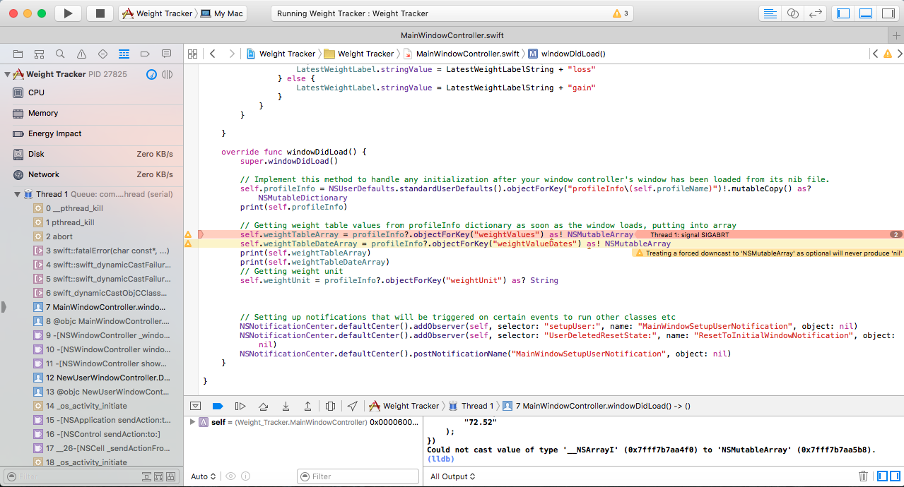
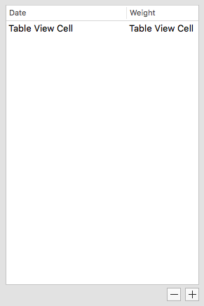
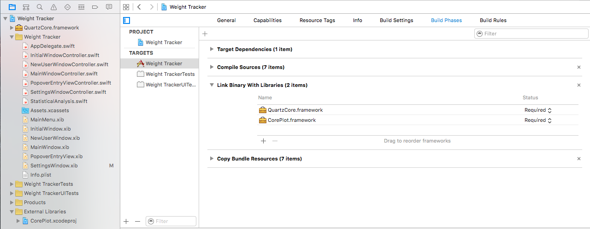
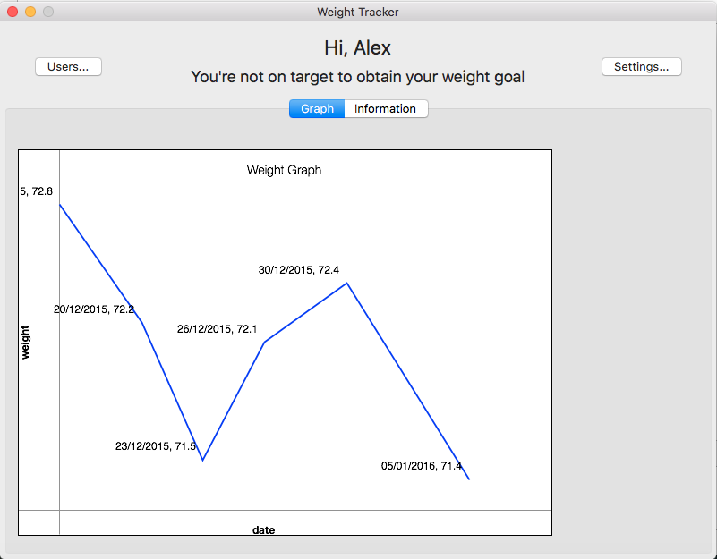

# Software Development
Note: A unabridged log of the changes to the code of this project can be found at https://github.com/alexpotter1/Weight-Tracker
## Initial stages
The code shown is being developed in accordance with Design Storyboard 2 and onwards - the first design had issues with configuring the project to work properly on the target machine so no code exists.

The first screenshot shows the initial window that the user will see (to login, create a new user, etc)


The initial skeleton code for the Application Delegate (that was created by the IDE) is shown here:


<div class="page-break"></div>


```swift
import Cocoa

@NSApplicationMain
class AppDelegate: NSObject, NSApplicationDelegate {

    @IBOutlet weak var window: NSWindow!
    @IBOutlet weak var ContinueButton: NSButton!


    func applicationDidFinishLaunching(aNotification: NSNotification) {
        // Insert code here to initialize your application

        // Disabling the continue button initially as no user would be selected
        ContinueButton.enabled = false
    }

    func applicationWillTerminate(aNotification: NSNotification) {
        // Insert code here to tear down your application
    }


}
```

The following screenshot shows the initial bindings for the outlets. After basic testing, the buttons worked.
*An outlet is a method of connecting a user interface object (e.g. a button) to the class controlling it so that it can be used.*


The following screenshot shows the new user window being added:


<div class="page-break"></div>

And the code for the controller of the window:
```swift
import Cocoa

class NewUserWindowController: NSWindowController, NSTextFieldDelegate {

    // Connecting Interface Builder objects to code
    @IBOutlet weak var NewUserTextField: NSTextField!
    @IBOutlet weak var DoneButton: NSButton!

    @IBAction func DoneButtonClicked(sender: NSButton) {
        // Check if array exists in NSUserDefaults (persistent storage)
        if NSUserDefaults.standardUserDefaults().objectForKey("NewUserNames") == nil {
            // Create new array of users and add the user to the list
            var textArray: [String] = []
            textArray.append(NewUserTextField.stringValue)

            // Save to persistent storage
            NSUserDefaults.standardUserDefaults().setObject(textArray, forKey: "NewUserNames")
            NSUserDefaults.standardUserDefaults().synchronize()
        }

        // Appending text input to the end of the user array stored in NSUserDefaults
        var textArrayDefaults = NSUserDefaults.standardUserDefaults().objectForKey("NewUserNames") as! [String]
        textArrayDefaults.append(NewUserTextField.stringValue)

        // For debugging purposes
        print("\(NewUserTextField.stringValue) saved to NSUserDefaults")

        // Saving back to NSUserDefaults
        NSUserDefaults.standardUserDefaults().setObject(textArrayDefaults, forKey: "NewUserNames")
        NSUserDefaults.standardUserDefaults().synchronize()

        /* Sending a notification to the other view controller that
        the data has been saved to NSUserDefaults. As a result, it can be
        used to populate the NSComboBox so that the user can choose a user */
        NSNotificationCenter.defaultCenter().postNotificationName("NameDataSavedNotification", object: nil)

        // Prevents modal sheet from blocking the app from exiting
        self.window?.close()
    }

    override func controlTextDidChange(notification: NSNotification) {
        /* Checking if the NSTextField is empty, as this would resolve a bug where
        the user could type, delete their input and still save an empty string */

        if !NewUserTextField.stringValue.isEmpty {
            DoneButton.enabled = true
        } else {
            DoneButton.enabled = false
        }
    }

    @IBAction func CancelButtonClicked(sender: NSButton) {
        // Tells everyone we want to return to the previous window, exits smoothly
        self.window?.close()
    }

    override func windowDidLoad() {
        // Initialisation call to the superclass to say that the window was loaded
        super.windowDidLoad()

        // Setting this view controller as the delegate for the New User text field
        NewUserTextField.delegate = self

        /* Initially set the Done button to be disabled as we don't want to create
        a user with no name. The button will be re-enabled when text is entered.
        Since this code is in the windowDidLoad function, it is immediately executed when the
        view loads. */

        if NewUserTextField.stringValue.isEmpty {
            DoneButton.enabled = false
        }
    }

}
```

<div class="page-break"></div>

Here, the code for handling the 'Done' button is already implemented, as well as code for the 'Cancel' button and code to run when the window loads.

The following code was added later on to populate the combo box with users that exist:
```swift
// Function that will fill the NSComboBox with users from persistent storage (NSUserDefaults)
// This will run when a NSNotification is received from the function that saves the data
func populateNSComboBox(notification: NSNotification) {
    print("Populating combo box")

    /* as! forces downcast to array of Strings from array of AnyObject, for type safety
    The app will crash though if this doesn't exist, but this function should only be called
    if this array exists in NSUserDefaults */
    let names = NSUserDefaults.standardUserDefaults().objectForKey("NewUserNames") as! [String]

    // Adding last element in the array, avoids duplicates
    UserComboBox.addItemWithObjectValue(names.last!)
}

// Function that runs when the user selects something in the NSComboBox
func comboBoxSelectionDidChange(notification: NSNotification) {
    // Enable Continue Button
    ContinueButton.enabled = true
    // Get selected name
    let savedString: String = UserComboBox.objectValueOfSelectedItem as! String

    // Save to NSUserDefaults under a key of currentUser
    // This will be the identity of the current user that the program will use
    NSUserDefaults.standardUserDefaults().setObject(savedString, forKey: "currentUser")

    // for debugging
    print("\(savedString) saved to NSUserDefaults")

}
```

<div class="page-break"></div>

These functions were called by notifications, so that other classes can use them. The notifications are setup here, so that the class can 'listen' for them.

```swift
// Setting up notification listeners to populate the dropdown box of users and to check if the user selected something in the NSComboBox
NSNotificationCenter.defaultCenter().addObserver(self, selector: "populateNSComboBox:", name: "NameDataSavedNotification", object: nil)
NSNotificationCenter.defaultCenter().addObserver(self, selector: "comboBoxSelectionDidChange:", name: "NSComboBoxSelectionDidChangeNotification", object: nil)
```

I found that the app had the potential to crash other apps randomly after exiting because of the notifications that it creates. As a result of this, I decided to remove the notifications to call functions within my application once the app terminates. The delegate handles this in the applicationWillTerminate function.

```swift
/* Removing listeners to all notifications created by this app so that other apps can't
use them (for stability reasons, less potential crashing in other apps) */
NSNotificationCenter.defaultCenter().removeObserver(self, name: "NameDataSavedNotification", object: nil)
NSNotificationCenter.defaultCenter().removeObserver(self, name: "NSComboBoxSelectionDidChangeNotification", object: nil)
NSNotificationCenter.defaultCenter().removeObserver(self, name: "FirstWindowCloseNotification", object: nil)
```

<div class="page-break"></div>

Next, the main window was created. This screenshot shows the initial UI as it was being created.


The initial code for the main window controller is shown:

```swift
import Cocoa

class MainWindowController: NSWindowController {

    // Connecting IB objects to code
    @IBOutlet weak var HelloLabel: NSTextField!
    @IBOutlet weak var LatestWeightLabel: NSTextField!

    // Loads the user's information and greeter (the two sentences at the top of the window)
    func setupUser() {
        let profileName = NSUserDefaults.standardUserDefaults().objectForKey("currentUser") as! String
        let profileInfo = NSUserDefaults.standardUserDefaults().objectForKey("profileInfo\(profileName)")

        // Customises the greeter
        HelloLabel.stringValue = "Hi, \(profileName)"

        // Displays tracked weight
        if profileInfo == nil { // shouldn't be nil
            LatestWeightLabel.stringValue = "No weight goal set yet..."
        } else {
            // Get values from dictionary
            let profileInfoDictionary = profileInfo as! NSMutableDictionary
            let weightUnitValue = profileInfoDictionary.valueForKey("weightUnit") as! String
            let weightValueArray = profileInfoDictionary.valueForKey("latestPredictedWeightLoss") as! NSArray
            let weightGainOrLoss = profileInfoDictionary.valueForKey("latestPredictedGain/Loss") as! Int
            var LatestWeightLabelValueSet: Bool = false
            var LatestWeightLabelString: String = ""

            switch weightUnitValue {
            case "kg":
                LatestWeightLabelString = "You're on track for \((weightValueArray as! [String]).last)kg weight "
            case "lbs":
                LatestWeightLabelString = "You're on track for \((weightValueArray as! [String]).last)lbs weight "
            case "stlbs":
                var stlbsArray: [String] = ((weightValueArray as! [String]).last?.componentsSeparatedByString(";"))!
                LatestWeightLabelString = "You're on track for \(stlbsArray[0])st \(stlbsArray[1])lbs weight "
            default:
                LatestWeightLabel.stringValue = "You're on track for 0kg weight loss"
                LatestWeightLabelValueSet = true
            }

            if LatestWeightLabelValueSet == false {
                if weightGainOrLoss == 0 { // 0 = loss, anything else = gain
                    HelloLabel.stringValue = LatestWeightLabelString + "loss"
                } else {
                    HelloLabel.stringValue = LatestWeightLabelString + "gain"
                }
            }
        }

    }

    override func windowDidLoad() {
        super.windowDidLoad()

        // Implement this method to handle any initialization after your window controller's window has been loaded from its nib file.

        // Posts notification to shutdown the other window, as we don't need it anymore
        NSNotificationCenter.defaultCenter().postNotificationName("FirstWindowCloseNotification", object: nil)

        setupUser()
    }

}

```

<div class="page-break"></div>

I came up with the setupUser function to allow the placeholder text in the image to be changed depending on who was signed in. This was so that the user can be told instantly whether they would meet their goal and also, which profile was signed in.

I then decided to refactor the code that was controlling the application itself into a new class (as per the design) instead of being in the application delegate.

## Second cycle

After the first cycle was completed, a prototype application was built and sent to the client.
The client subsequently responded with feedback, that formed a basis for progressing with the second cycle of development.

The user interface of the first window (profile selection screen) was changed in response to a few points of feedback that the client gave:

>* Move the 'Create new user' button to the left
>* Reduce white space, balance the position of objects on screen
>* Change the window size to eliminate wasted white space


The main window's user interface was also iterated upon, with buttons to the profile settings window and another button to move back to the initial (user selection screen) at the top of the window:


The settings window was also created, with a single dropdown box indicating the weight goal done at this stage:


<div class="page-break"></div>

In the main window controller class, code was also added to handle the button presses to move between the initial user screen and the settings screen:

```swift
// Keep an optional reference to window controllers
var initVC: InitialWindowController? = nil
var SettingsController: SettingsWindowController? = nil


// Connecting IB objects to code
@IBOutlet weak var HelloLabel: NSTextField!
@IBOutlet weak var LatestWeightLabel: NSTextField!
@IBOutlet weak var SettingsButton: NSButton!

@IBAction func UsersButtonClicked(sender: NSButton) {
    // Creating a new reference to window controller, and loading
    initVC = InitialWindowController(windowNibName: "InitialWindow")
    initVC?.loadWindow()
    initVC?.windowDidLoad()
    initVC?.showWindow(self)

    self.window?.close()
}

@IBAction func SettingsButtonClicked(sender: NSButton) {
    SettingsController = SettingsWindowController(windowNibName: "SettingsWindow")
    self.window!.beginSheet(SettingsController!.window!, completionHandler: nil)
}
```

<div class="page-break"></div>

In addition, the Settings Window Controller class was created and this code was added to handle the loading of the window, the 'Done' button press and a function that was called when the weight unit box was changed:

```swift
import Cocoa

class SettingsWindowController: NSWindowController {

    // Connecting IB objects to code
    @IBOutlet weak var WeightUnitBox: NSPopUpButton!
    @IBAction func DoneButtonClicked(sender: NSButton) {
        self.window!.close()
    }

    func weightUnitSelectionDidChange(notification: NSNotification) {
        let selectedItem = WeightUnitBox.titleOfSelectedItem
        if selectedItem != nil {
            print(selectedItem!)
            NSUserDefaults.standardUserDefaults().setObject(selectedItem!, forKey: "SettingsWeightUnitItem")
            NSUserDefaults.standardUserDefaults().synchronize()
        }
    }

    override func windowDidLoad() {
        super.windowDidLoad()
        NSNotificationCenter.defaultCenter().addObserver(self, selector: "weightUnitSelectionDidChange:", name: NSMenuDidSendActionNotification, object: self.WeightUnitBox.menu)

        // Implement this method to handle any initialization after your window controller's window has been loaded from its nib file.
    }

}
```

A potential bug arose when creating the application at this point that involved the stone and pounds (st lbs) weight unit - I figured that I was only using one value to store both components of the weight value rather than two values, so the "lbs" part of the weight would never be represented.
I fixed that with this code, in the main window class:

```swift
let lastWeightValueArray: [String] = ((profileInfoDictionary.valueForKey("latestPredictedWeightLoss") as! [String]).last?.componentsSeparatedByString(";"))!
let stoneValue = lastWeightValueArray.last!.componentsSeparatedByString(".")
```

<div class="page-break"></div>

This places the weight into a new array that contains two values at two indices - the "st" value and the "lbs" value. The value stored in the persistent storage would be split by the delimiter ";", as this is an uncommon enough character.

In the new user class, the dictionary containing the user's information was changed from this:
```swift
let profileInfoDictionary: NSMutableDictionary = NSMutableDictionary(objects: ["", ["0.0"], 0], forKeys: ["weightUnit", "latestPredictedWeightLoss", "latestPredictedGain/Loss"])
```
to this:
```swift
let profileInfoDictionary: NSMutableDictionary = NSMutableDictionary(objects: ["", ["0.0;0.0"], 0], forKeys: ["weightUnit", "latestPredictedWeightLoss", "latestPredictedGain/Loss"])
```
to facilitate the change discussed above.

After this, a new button was added to the settings window so that the user can delete their own profile. This was requested, and falls into the requirement of being able to manage the profiles effectively.


The code that was added to facilitate this new button was a new outlet connected to a function in the settings window controller that initialises and shows a new alert. This was designed so that the user can't accidentally delete their own profile, so this dialog asks for confirmation.

```swift
@IBAction func DeleteUserButtonClicked(sender: NSButton) {
    // Create alert for confirmation of deleting the user
    let alert = NSAlert()
    alert.alertStyle = NSAlertStyle.CriticalAlertStyle
    alert.messageText = "Are you sure?"
    alert.informativeText = "Are you sure that you want to delete the current user? This action cannot be undone."
    alert.addButtonWithTitle("Delete")
    alert.addButtonWithTitle("Return")
    // Present this window as the sliding sheet that appears over the previous window
    alert.beginSheetModalForWindow(self.window!, completionHandler: self.DeleteUserAlertHandler)
}

func DeleteUserAlertHandler(choice: NSModalResponse) {
    switch choice {
    case NSAlertFirstButtonReturn:
        // We're deleting the user...
        let userArray = NSUserDefaults.standardUserDefaults().objectForKey("NewUserNames")!.mutableCopy() as! NSMutableArray
        let currentUser = NSUserDefaults.standardUserDefaults().objectForKey("currentUser") as! String
        userArray.removeObjectIdenticalTo(currentUser)

        // Save new user array back to NSUserDefaults
        NSUserDefaults.standardUserDefaults().setObject(userArray, forKey: "NewUserNames")

        // Close the settings and main windows
        NSNotificationCenter.defaultCenter().postNotificationName("ResetToInitialWindowNotification", object: nil)
        self.window!.close()

        // Initiate the initial user selection screen, and show the window
        InitialWC = InitialWindowController(windowNibName: "InitialWindow")
        InitialWC!.showWindow(self)

    case NSAlertSecondButtonReturn:
        // debug
        if devSettings.DebugPrintingEnabled == true {
            print("return")
        }
    default: break
    }
  }
```

The second function is a completion handler that is set to the alert - this figures out which button was pressed by the user, and takes appropriate actions. Here, if the user clicks the OK button, then the profile is actually deleted, otherwise the alert window closes and the user focus is back on the settings window.


<div class="page-break"></div>

## Third cycle
I sent the second prototype to the client - feedback was again constructive, and they mentioned two main points:

> * In the new user window, instead of going back to the previous window after clicking Done it should move to the main window
> * The user selection screen needs validation to make sure that two users can not share the same name - otherwise there is no way of differentiating between them.

Like the 'Delete User' alert, I figured that I could create this programmatically as it was very simple and there is no way of customising the visual appearance of this alert, since it is a predefined class in the Cocoa framework.

In the new user window controller, and under the 'DoneButtonClicked' function, I added the following code to allow the application to meet the second point of the client's feedback at this stage:

```swift
if userArray.contains(NewUserTextField.stringValue) {
    // The user is trying to create a profile with the same name as another one, so present an alert dialog
    let alert = NSAlert()
    alert.alertStyle = NSAlertStyle.CriticalAlertStyle
    alert.messageText = "Cannot create user"
    alert.informativeText = "Multiple user profiles cannot exist with the same name. A profile exists with the name that you have typed. Please type a different profile name."
    alert.addButtonWithTitle("OK")
    alert.beginSheetModalForWindow(self.window!, completionHandler: nil)
```

The alert looks like this:


In addition, I changed the behaviour of the new user window to automatically launch the main window with the newly-created profile active - this would therefore allow the application to meet the first point of the client's feedback at this stage.
First of all, I added a new notification and corresponding selector function to run when the first (initial) window closes - when the user clicks 'Done' after making a new user:

```swift
func endWindow(notification: NSNotification) {
    self.window?.close()
}
```

(in the windowDidLoad function)

```swift
NSNotificationCenter.defaultCenter().addObserver(self, selector: "endWindow:", name: "FirstWindowEndedNotification", object: nil)
```

Next, I added code to launch the main window after clicking 'Done', and post a notification to close the initial window (user selection screen):
```swift
// Go straight to main window and set user accordingly
NSUserDefaults.standardUserDefaults().setObject(NewUserTextField.stringValue, forKey: "currentUser")
NSUserDefaults.standardUserDefaults().synchronize()

MainWC = MainWindowController(windowNibName: "MainWindow")
MainWC!.showWindow(self)
self.window?.close()
NSNotificationCenter.defaultCenter().postNotificationName("FirstWindowEndedNotification", object: nil)
```

<div class="page-break"></div>

#### App crash 1
However, after doing this, I ran into an unexpected bug. When a profile was deleted, the user selection screen returns to be the focus of the application. Next, when any other profile is selected, the application crashes immediately.


As the screenshot shows, the application process is terminated on this line, with error **EXC_BAD_INSTRUCTION**:

```swift
let savedString: String = UserComboBox.objectValueOfSelectedItem as! String
```

I decided to debug the program, and investigated the state of this variable by adding a breakpoint on this line so that execution would be terminated at this point.
By doing this, a console showed which allowed me to print out the variable's contents:


The solution to this bug was, to be frank, hard to identify. Then, I got a full error report, indicating the exact type of exception that occurred (on my development machine):


Since the exception type was **EXC_CORPSE_NOTIFY**, I figured it could be a cause of the automatic reference counting built into the Swift language, coupled with a forced downcast to a String type. Since the user was deleted, the name of it won't show in the combo box anymore, so the string of the user's name would have been deinitialised. Therefore any attempts to access this variable would have resulted in garbage data, which would have caused an application crash if the data was attempted to be used in any meaningful way.

The line of code was replaced with:

```swift
let savedString: String? = UserComboBox.objectValueOfSelectedItem as? String
```

Then, the debugger showed the value of the variable at the breakpoint as this:


The variable now contained a value, instead of a dereferenced garbage value, so the application didn't crash.

<div class="page-break"></div>

Next up was the implementation of the weight table. This is an important part of the development process as the ability to record the user's weight values is one of the main system requirements of the application.

The MainWindowController class would control the communication with the NSTableView, so I have to do the following:

* Make the MainWindowController class the delegate and data source of the weight table view, so that it can control and supply data to the table
* Add buttons into the main window to facilitate control of the weight table, such as adding records and deleting records.

The first thing I did was to add the table view and 'Add record' button in the user interface file, and then add an outlet to the NSTableView in the user interface file, and add an IBAction function to run when the 'Add record' button was clicked.

The table looked like this initially:


And this was the code:

```swift
@IBOutlet weak var WeightTable: NSTableView!

@IBAction func WeightTableAddButtonClicked(sender: NSButton) {

}
```

<div class="page-break"></div>

Both outlets were linked to the user interface objects via these outlet connections - in particular, the WeightTable outlet and the WeightTableAddButtonClicked outlet:


Then, I modified the code to allow the table to display records.
The first modification was to set the class as the *delegate* for the table view (this allows the class to control it by overriding the table view's methods) and to set the class as the *data source* for the table, so that it can accept the user's weight data that would be handled by this class.

```swift
class MainWindowController: NSWindowController, NSTableViewDelegate, NSTableViewDataSource {
```
The next thing to add was some variables at the beginning of the class - this was for retrieval/storage of the weight values (and the dates associated with them) from persistent storage.
```swift
let profileName = NSUserDefaults.standardUserDefaults().objectForKey("currentUser") as! String
var profileInfo: NSMutableDictionary? = nil
var weightTableArray: NSMutableArray? = nil
var weightTableDateArray: NSMutableArray? = nil

var weightUnit: String? = nil
```

The next two functions that I added were the delegate functions to the table. The first one returns the number of rows in the table, so that the table knows how many rows it needs to display.
For this, I simply used the number of objects in the weight array (that holds the user weight values).
The second function provides the table with the view to display in the table, and it populates the cell in the table with the appropriate data.
For this, I had to use two identifiers for each cell of the table - *"weightDates"* and *"weightValues"* (there were 2 cells - one for weight and one for date), so the function can show both cells and their records.
The function would then get the appropriate record from the array, and set the table cell's text field to equal either the date or the weight concatenated with the user's weight unit.

**These functions are not called by my code; rather they are called automatically by the table when data needs to be added.**

```swift
func numberOfRowsInTableView(tableView: NSTableView) -> Int {
    print(self.weightTableArray!.count)
    return self.weightTableArray!.count
}

func tableView(tableView: NSTableView, viewForTableColumn tableColumn: NSTableColumn?, row: Int) -> NSView? {
    print("table view func run")
    var tableCellView: NSTableCellView = tableView.makeViewWithIdentifier(tableColumn!.identifier, owner: self) as! NSTableCellView

    if tableColumn!.identifier == "weightDates" {
        let date = self.weightTableDateArray![row]
        tableCellView.textField!.stringValue = date as! String
        return tableCellView
    }

    if tableColumn!.identifier == "weightValues" {
        print("filling values")
        let weight = self.weightTableArray![row]
        tableCellView.textField!.stringValue = weight as! String + weightUnit!
        return tableCellView
    }


    return tableCellView

}
```

<div class="page-break"></div>

I also added code to the windowDidLoad function to load user data from persistent storage as soon as the window loads and store them into the class variables added above, so that the table can show the data.
```swift
// Getting weight table values from profileInfo dictionary as soon as the window loads, putting into array
self.weightTableArray = profileInfo?.objectForKey("weightValues") as! NSMutableArray
self.weightTableDateArray = profileInfo?.objectForKey("weightValueDates") as! NSMutableArray
print(self.weightTableArray)
print(self.weightTableDateArray)
// Getting weight unit
self.weightUnit = profileInfo?.objectForKey("weightUnit") as? String
```

#### App crash 2
Upon testing this code, it didn't work correctly - the application crashed.



The line it crashed on was the one in red - retrieval of the weight array from the persistent storage database failed.
This bug was fairly trivial to resolve - in the persistent storage, these arrays are stored as immutable NSArrays. However, I was attempting to cast them to mutable NSMutableArrays with a downcast. Swift is very strict on object types in general, and you cannot do this.

I changed that line (and the line underneath) from this:

```swift
self.weightTableArray = profileInfo?.objectForKey("weightValues") as! NSMutableArray
self.weightTableDateArray = profileInfo?.objectForKey("weightValueDates") as! NSMutableArray
```

to this:

```swift
self.weightTableArray = profileInfo?.objectForKey("weightValues")!.mutableCopy() as! NSMutableArray
self.weightTableDateArray = profileInfo?.objectForKey("weightValueDates")!.mutableCopy() as! NSMutableArray
```

The mutableCopy function on the arrays properly transforms them to mutable arrays, so this worked.

Now I needed to change the dictionary in the persistent storage database to reflect the new keys (*weightValues* and *weightValueDates*), and add some temporary placeholder values to test if the weight table functions:

```swift
let profileInfoDictionary: NSMutableDictionary = NSMutableDictionary(objects: ["", ["0.0;0.0"], 0, ["72.6", "72.52"], ["Sep 29 2015", "Oct 2 2015"]], forKeys: ["weightUnit", "latestPredictedWeightLoss", "latestPredictedGain/Loss", "weightValues", "weightValueDates"])
```

The weight table subsequently functioned correctly.


<div class="page-break"></div>

The next thing to do was to make the 'Add record' button on the weight table functional. As the client requested a *"calculator"* or *"keypad"* type interface for entering the weight values, I created a "popover" to display over the main window and allow the user to enter their weight value, as mentioned in *Design Progression*.

I first created a new class called PopoverEntryViewController that inherits from NSViewController. This is different to the inheritance of the other classes (they inherit from NSWindowController) - since a popover is a view, not a full window. The only function this class overrides from its superclass originally is viewDidLoad, which simply runs when the view loads.

I added outlets to the weight entry field, 'Done' button, clear button and all of the number buttons.

<div class="page-break"></div>

```swift
import Cocoa

class PopoverEntryViewController: NSViewController {

    // Connecting IB objects
    @IBOutlet weak var EntryField: NSTextField!
    @IBAction func DoneButtonPressed(sender: NSButton) {
      // First, check that there is actually a value in the field
        if !(EntryField.stringValue.isEmpty) {
            // Get values from NSUserDefaults
            let currentProfileName = NSUserDefaults.standardUserDefaults().objectForKey("currentUser") as! String
            var profileInfoDictionary: NSMutableDictionary = NSUserDefaults.standardUserDefaults().objectForKey("profileInfo\(currentProfileName)")!.mutableCopy() as! NSMutableDictionary

            var weightValueArray = profileInfoDictionary.objectForKey("weightValues")!.mutableCopy() as! NSMutableArray
            var weightDateArray = profileInfoDictionary.objectForKey("weightValueDates")!.mutableCopy() as! NSMutableArray

            // Get current system date
            let date = NSDate()
            let dateFormatter = NSDateFormatter()
            dateFormatter.dateStyle = NSDateFormatterStyle.FullStyle
            let localDateRightNow: String = dateFormatter.stringFromDate(date)

            // Save new weight to arrays
            weightDateArray.addObject(localDateRightNow)
            weightValueArray.addObject(EntryField.stringValue)

            // Save modified arrays to NSUserDefaults
            profileInfoDictionary.setObject(weightDateArray, forKey: "weightValueDates")
            profileInfoDictionary.setObject(weightValueArray, forKey: "weightValues")
            NSUserDefaults.standardUserDefaults().setObject(profileInfoDictionary, forKey: "profileInfo\(currentProfileName)")
            NSUserDefaults.standardUserDefaults().synchronize()

            // Sends a notification through the first responder chain to the first class that implements a method that matches the selector ("updateWeightTable")
            // In this case, it should be MainWindowController
            NSApplication.sharedApplication().sendAction("updateWeightTable", to: nil, from: nil)

        }
        self.view.window!.close()

    }

    // sender: any of the number buttons
    @IBAction func numberPressed(sender: NSButton) {
        let number = sender.title
        EntryField.stringValue += number
    }

    // sender: the clear button
    @IBAction func ClearButtonPressed(sender: NSButton) {
        EntryField.stringValue = ""
    }


    override func viewDidLoad() {
        if #available(OSX 10.10, *) {
            super.viewDidLoad()
        } else {
            // Fallback on earlier versions
        }
        // Do view setup here.
    }

}
```

<div class="page-break"></div>

* The 'DoneButtonPressed' function simply gets the latest user data from persistent storage, and adds a new weight value and weight date, saves the arrays back to persistent storage and sends a notification to the main window controller class to update the weight table with the new values.
If the weight entry field is empty, it does nothing and just closes the window.
* The 'numberPressed' function gets the number of the sender button (by the sender button's title) and appends that to the string shown in the weight entry field (EntryField)
* The 'ClearButtonPressed' function simply resets the weight entry field to an empty string.

In the MainWindowController class, code was added to the WeightTableAddButtonClicked function to launch the new popover.

```swift
// Load popover
WeightEntryPopover = NSPopover()
WeightEntryPopover?.contentViewController = PopoverEntryViewController(nibName: "PopoverEntryView", bundle: nil)
WeightEntryPopover?.showRelativeToRect(WeightTableAddButton.bounds, ofView: WeightTableAddButton, preferredEdge: NSRectEdge.MaxY)
```

And a new function to add a value to the weight table:

```swift
func updateWeightTable() {
    self.profileInfo = NSUserDefaults.standardUserDefaults().objectForKey("profileInfo\(self.profileName)")!.mutableCopy() as? NSMutableDictionary

    // Getting weight table values from profileInfo dictionary as soon as the window loads, putting into array
    self.weightTableArray = profileInfo?.objectForKey("weightValues")!.mutableCopy() as? NSMutableArray
    self.weightTableDateArray = profileInfo?.objectForKey("weightValueDates")!.mutableCopy() as? NSMutableArray

    // Getting weight unit
    self.weightUnit = profileInfo?.objectForKey("weightUnit") as? String

    // debugging
    if devSettings.DebugPrintingEnabled == true {
        print(self.profileInfo)
        print(self.weightTableArray)
        print(self.weightTableDateArray)
    }
    // Only adding to the end of the table, so the index of the last weight value should be okay here
    let rowIndex = self.weightTableArray!.count - 1
    self.WeightTable.insertRowsAtIndexes(NSIndexSet(index: rowIndex), withAnimation: NSTableViewAnimationOptions.EffectGap)  
}
```

<div class="page-break"></div>

The popover interface was designed as this:


Testing the table again worked correctly:

I did change the format of the date with this code (in the DoneButtonPressed function in the PopoverEntryViewController class):
```swift
dateFormatter.dateStyle = NSDateFormatterStyle.FullStyle
```

I noticed a small bug in the program - when the user changed the weight unit, they would have to log out and back into their profile to view the changes.

Adding a notification function to the main window controller class allowed the user data to be reloaded:

```swift
func updateUserNotification(notification: NSNotification) {
    self.updateWeightTable()
}
```

<div class="page-break"></div>

In the windowDidLoad function, a new observer was added to handle this new function:
```swift
NSNotificationCenter.defaultCenter().addObserver(self, selector: "updateUserNotification:", name: "UpdateUserData", object: nil)
```

And in the SettingsWindowController class (weightUnitSelectionDidChange function):

```swift
NSNotificationCenter.defaultCenter().postNotificationName("UpdateUserData", object: nil)
```

Adding this line to the tableView: viewForTableColumn delegate function also reloads the weight table data after the arrays have been reloaded:

```swift
tableView.reloadData()
```

The weight table, when tested, now functions correctly.


<div class="page-break"></div>

Next, I added a delete button to the weight table to allow the user to delete a record. This allows the application to conform better to the requirement of being able to manage the weight data effectively.

The user interface for the table was changed slightly to accommodate the new button:


I then changed the updateUserWeightData function in MainWindowController to have multiple modes so that deleting a record can be accomplished.
Basically if the mode selected is equal to 1, then the table is simply reloaded for new data.
If it is equal to 2, then the table removes the row at the index of the current selected row, removes the value from the weight/date arrays and saves them back to persistent storage.
```swift
func updateUserWeightData(mode: Int) {
    var rowIndex = 0

    if mode == 1 {
        WeightTable.reloadData()
    } else if mode == 2 { // delete selected row in table

        if WeightTable.numberOfSelectedRows == 0 {
            return
        }

        rowIndex = WeightTable.selectedRow
        WeightTable.removeRowsAtIndexes(NSIndexSet(index: rowIndex), withAnimation: NSTableViewAnimationOptions.EffectGap)

    }
    self.profileInfo = NSUserDefaults.standardUserDefaults().objectForKey("profileInfo\(self.profileName)")!.mutableCopy() as? NSMutableDictionary

    // Getting weight table values from profileInfo dictionary as soon as the window loads, putting into array
    self.weightTableArray = profileInfo?.objectForKey("weightValues")!.mutableCopy() as? NSMutableArray
    self.weightTableDateArray = profileInfo?.objectForKey("weightValueDates")!.mutableCopy() as? NSMutableArray

    // Getting weight unit to redisplay in table
    self.weightUnit = profileInfo?.objectForKey("weightUnit") as? String

    if mode == 2 { // deleting row's value in array
        self.weightTableArray?.removeObjectAtIndex(rowIndex)
        self.weightTableDateArray?.removeObjectAtIndex(rowIndex)

        // Saving back to persistent storage
        self.profileInfo?.setObject(weightTableArray!, forKey: "weightValues")
        self.profileInfo?.setObject(weightTableDateArray!, forKey: "weightValueDates")
        NSUserDefaults.standardUserDefaults().setObject(self.profileInfo, forKey: "profileInfo\(self.profileName)")
        NSUserDefaults.standardUserDefaults().synchronize()

    }

    // debugging
    if devSettings.DebugPrintingEnabled == true {
        print(self.profileInfo)
        print(self.weightTableArray)
        print(self.weightTableDateArray)
    }
}
```

<div class="page-break"></div>

And I simply added a new outlet for the delete button, to run the updateUserWeightData function with the option to delete the current selected row:

```swift
@IBAction func WeightTableDeleteButtonClicked(sender: NSButton) {
    self.updateUserWeightData(2)
}
```

Testing this button worked properly.

I ran into another problem due to incomplete testing of the weight table - for the "st lbs" unit, the weight doesn't display correctly. The photo below shows this:

In this picture, the first number before the decimal point should be before the "st" part of the unit, and the number after the decimal point should be after the "lbs" part of the unit.

The way that I fixed this was to introduce a check in the tableView: viewForTableColumn function in MainWindowController for the weight unit. If the unit is the stone & pounds unit, then split the weight by the decimal point into an array and combine each sub-part of the weight and unit with each other, finally displaying it in the window.

```swift
// We have to do some extra processing on the displayed weight if the weight unit is stones and pounds...
if self.weightUnit! == "st lbs" {
    // Splitting the weight value into two components (before and after the decimal point)
    let weight = weight.componentsSeparatedByString(".")

    // Doing a similar thing with the unit, except it's separated by a space (st lbs)
    let unit = self.weightUnit!.componentsSeparatedByString(" ")

    // Finally, combining everything to fix the displayed weight value in st lbs;
    tableCellView.textField!.stringValue = weight[0] + unit[0] + " "  + weight[1] + unit[1]
    return tableCellView
}
```

Next, I added the information associated with the Weight Goal, since that wasn't added yet. The following things needed to be done, according to the requirements:

* Add a weight goal setting in the settings window, to allow the user to set their goal and date
* Show the weight goal and date on the main window
* Predict the next weight (in a timeframe such as for the next week)

The first thing I did in this respect to this was to add a label on the main window for the weight goal and date.

Note that the "\u" in the label isn't the actual text; it is to be replaced by the program to the actual goal and date.

An outlet to the label was created:
```swift
@IBOutlet weak var WeightGoalLabel: NSTextField!
```

In the setupUser function, I added the code to display the weight goal value. This was simple - the only thing to consider here was if the unit was "st lbs", as I would need to split the weight value as I discussed before.

```swift
// Display weight goal
let weightGoalArray: NSArray? = self.profileInfo!.valueForKey("weightGoal") as? NSArray
if weightGoalArray != nil {

    if weightUnitValue == "st lbs" {
        // Separating stone and pounds values by decimal point
        let values: [String] = (weightGoalArray![0]).componentsSeparatedByString(".")
        WeightGoalLabel.stringValue = "\(values[0])st \(values[1])lbs by \(weightGoalArray![1])"
    } else {
        // Just show the weight goal, don't modify
        WeightGoalLabel.stringValue = "\(weightGoalArray![0])\(weightUnitValue) by \(weightGoalArray![1])"
    }
} else {
    // Just display something to tell the user the weight goal needs to be set
    WeightGoalLabel.stringValue = "No weight goal set yet, set one in Settings"
}
```

The reference to *weightGoalArray* here is new, so a new key and value pair needs to be added to the profileInfoDictionary in persistent storage:
```swift
let profileInfoDictionary: NSMutableDictionary = NSMutableDictionary(objects: ["", ["0.0;0.0"], 0, [], [], [0.0, "24/02/12"]], forKeys: ["weightUnit", "latestPredictedWeightLoss", "latestPredictedGain/Loss", "weightValues", "weightValueDates", "weightGoal"])
```
The first object in this array is the actual goal value, and the second object is the date for the goal.

For the settings window, I had to add UI objects that allow the user to input their goal. This would consist of an NSTextField, for entry of the weight value, and an NSDatePicker to pick the date value.

This is a screenshot of the UI in Xcode when it was designed:


First of all, in terms of modifying SettingsWindowController, it had to be set as the delegate to the weight goal value's text box - this is so that it can collect what is entered into the box and update the value in persistent storage respectively.
```swift
class SettingsWindowController: NSWindowController, NSTextFieldDelegate {
```

Next, the outlets for the weight goal UI objects were added, as well as class variables to hold data for persistent storage so that all the functions in the class can use them.
```swift
@IBOutlet weak var WeightGoalUnit: NSTextField!
@IBOutlet weak var WeightGoalValue: NSTextField!
@IBOutlet weak var WeightGoalDate: NSDatePicker!

var currentUser: String!
var profileInfoDictionary: NSMutableDictionary!
var weightGoalArray: NSMutableArray!
```

The DoneButtonClicked function was modified extensively, so that the values entered into the weight goal boxes can be stored appropriately.

<div class="page-break"></div>

```swift
@IBAction func DoneButtonClicked(sender: NSButton) {

    self.currentUser = NSUserDefaults.standardUserDefaults().objectForKey("currentUser") as! String
    self.profileInfoDictionary = NSUserDefaults.standardUserDefaults().objectForKey("profileInfo\(self.currentUser)")?.mutableCopy() as! NSMutableDictionary

    /* Checking first that the zeroth value in the weight goal array (the weight goal value) is initialised (by default it is 0)
       This helps to prevent a runtime crash if the user doesn't type anything in the weight goal box.
       If the user didn't type anything, then just exit the window. */

    if !(self.weightGoalArray[0] as! String == "0.0") {
        // Obtaining NSDate value in weight goal date box (time in seconds since January 1, 2001)
        let date: NSDate = WeightGoalDate.dateValue
        // Making date value look nice (formatted e.g. Fri, 15 Jan 2016)
        let dateFormatter = NSDateFormatter()
        dateFormatter.dateFormat = "EEE, d MMM yyyy"
        let formattedDate = dateFormatter.stringFromDate(date)

        // Saving date to weight goal array, and then to persistent storage
        self.weightGoalArray.replaceObjectAtIndex(1, withObject: formattedDate)

        self.profileInfoDictionary?.setObject(self.weightGoalArray!, forKey: "weightGoal")
        NSUserDefaults.standardUserDefaults().setObject(self.profileInfoDictionary, forKey: "profileInfo\(self.currentUser)")
        NSUserDefaults.standardUserDefaults().synchronize()

    }

    // Reloads the window below the settings sheet
    NSNotificationCenter.defaultCenter().postNotificationName("UpdateUserData", object: nil)
    self.window!.close()
}
```


<div class="page-break"></div>

I also used an override on a NSTextField delegate function to continuously update the weight array with whatever the user types in. This function is called automatically by the text field itself whenever the text in the field changes.

```swift
// Detects if the user typed anything in the Weight Goal box; overriding from NSTextFieldDelegate protocol
override func controlTextDidChange(obj: NSNotification) {
    // Set first object at index of weight goal array to whatever the user types
    self.weightGoalArray.replaceObjectAtIndex(0, withObject: WeightGoalValue.stringValue)
}
```

I also modified the windowDidLoad function so that the existing weight goal data was input into both the NSTextField and the NSDatePicker.
This won't need to be reloaded again, hence why I put it in the windowDidLoad function as this only gets called once.

```swift
self.currentUser = (NSUserDefaults.standardUserDefaults().objectForKey("currentUser") as! String)
self.profileInfoDictionary = NSUserDefaults.standardUserDefaults().objectForKey("profileInfo\(currentUser)")?.mutableCopy() as? NSMutableDictionary

// Loading this once to avoid performance penalty of fetching this array every time a key is pressed
self.weightGoalArray = self.profileInfoDictionary?.valueForKey("weightGoal")!.mutableCopy() as! NSMutableArray

// Load weight goal data (value and date)
// Have to convert the stored date into the type NSDate
WeightGoalValue.stringValue = self.weightGoalArray[0] as! String
let dateFormatter = NSDateFormatter()
dateFormatter.dateFormat = "EEE, d MMM yyyy"
let NSDatePickerDate: NSDate = dateFormatter.dateFromString(self.weightGoalArray[1] as! String)!
WeightGoalDate.dateValue = NSDatePickerDate

// Setting Weight Goal Value (label) based upon user's weight unit selection choice
WeightGoalUnit.stringValue = self.profileInfoDictionary?.valueForKey("weightUnit") as! String + " by"
```

<div class="page-break"></div>

Remaining on the list to implement was the prediction of the next weight value.

Initially, I decided to try out using percentage differences as a test because this was easy to implement and it only required a few functions.
I later changed this as I felt that the method that I actually used, which was Linear Regression, was much more accurate and provided much more meaningful feedback to the user.

First thing to add here was the label for the expected weight.
The UI in Xcode looked like this:


The outlet was added:
```swift
@IBOutlet weak var ExpectedWeightLabel: NSTextField!
```

Three functions were added to the MainWindowController class:


<div class="page-break"></div>

```swift
func calculateWeightDelta(weight1: AnyObject, weight2: AnyObject) -> Double {
    let dWeight1: Double = (weight1 as! NSString).doubleValue
    let dWeight2: Double = (weight2 as! NSString).doubleValue

    // Percentage difference formula: (| V1 - V2 | / (V1 + V2)/2) * 100

    let difference = dWeight2 - dWeight1
    let average = (dWeight1 + dWeight2)/2

    return (difference/average) * 100
}

func expectedWeight() {
    self.weightTableArray = (self.profileInfo?.valueForKey("weightValues")?.mutableCopy() as! NSMutableArray)
    self.weightTableDateArray = (self.profileInfo?.valueForKey("weightValueDates")?.mutableCopy() as! NSMutableArray)

    var timeDelta = 0.0
    var weightDelta = 0.0

    if self.weightTableDateArray!.count < 2 || self.weightTableArray!.count < 2 {
        ExpectedWeightLabel.stringValue = "Not enough weight values yet..."

    } else if self.weightTableDateArray!.count % 2 == 0 {
        for (var i = 0; i <= (self.weightTableDateArray!.count - 1)/2; i++) {
            timeDelta += self.calculateTimeDelta(self.weightTableDateArray![i] as! String, date2: self.weightTableDateArray![i+1] as! String)
        }

        for (var i = 0; i <= (self.weightTableArray!.count - 1)/2; i++) {
            weightDelta += self.calculateWeightDelta(self.weightTableArray![i], weight2: self.weightTableArray![i+1])
        }

    } else {
        for (var i = 0; i <= (self.weightTableDateArray!.count - 2)/2; i++) {
            timeDelta += self.calculateTimeDelta(self.weightTableDateArray![i] as! String, date2: self.weightTableDateArray![i+1] as! String)
        }

        for (var i = 0; i <= (self.weightTableArray!.count - 2)/2; i++) {
            weightDelta += self.calculateWeightDelta(self.weightTableArray![i], weight2: self.weightTableArray![i+1])
        }

    }

    if self.weightTableArray!.count > 1 {
        timeDelta /= Double(self.weightTableDateArray!.count - 1)
        weightDelta /= Double(self.weightTableArray!.count - 1)

        let adjustedWeightDelta = weightDelta / 100 // because weightDelta is a percentage
        let expectedWeight = ((self.weightTableArray?.lastObject)!.doubleValue * adjustedWeightDelta) + (self.weightTableArray?.lastObject)!.doubleValue

        let dateFormatter = NSDateFormatter()
        dateFormatter.dateFormat = "EEE, d MMM yyyy"
        let date = dateFormatter.dateFromString(self.weightTableDateArray!.lastObject as! String)

        let expectedDate: NSDate = (date?.dateByAddingTimeInterval(timeDelta))!
        let expectedDateString = dateFormatter.stringFromDate(expectedDate)

        // Display next expected weight, format to 2 decimal places
        ExpectedWeightLabel.stringValue = String(format: "%.2f", expectedWeight) + self.weightUnit! + " by \(expectedDateString)"
    } else {
        ExpectedWeightLabel.stringValue = "Not enough weight values yet..."
    }

}

// Use date format 'EEE, d MMM yyyy' otherwise this procedure returns garbage out
// date2 always > date1 (date2 is more recent than date1)
func calculateTimeDelta(date1: String, date2: String) -> NSTimeInterval {
    let dateFormatter = NSDateFormatter()
    dateFormatter.dateFormat = "EEE, d MMM yyyy"

    // Converting human-readable date strings to NSDates
    let dateTimestamp1: NSDate = dateFormatter.dateFromString(date1)!
    let dateTimestamp2: NSDate = dateFormatter.dateFromString(date2)!

    // Getting absolute value of the time delta between the dates (in seconds)
    let timeDelta: NSTimeInterval = fabs(dateTimestamp2.timeIntervalSinceDate(dateTimestamp1))

    return timeDelta
}
```

The expectedWeight function is the first to be called out of the three - this changes the Expected Weight Label outlet. For each value in the weight and date arrays (up to half way in the arrays), the percentage difference of the two adjacent weight values in the array and the absolute value of the time difference between the two adjacent date values in the array would be calculated and added to variables *timeDelta* and *weightDelta*.

This was very inaccurate, and hard to implement as I kept getting out of bounds errors with the arrays and the for loops iterating over them.

Testing the table worked, and the expected label appears to be accurate for a few values in the array:


<div class="page-break"></div>

However, since the calculation only ever considered half of the values in the arrays (due to those out of bounds errors), for larger data sets it got more and more inaccurate.

So, I decided to delete all of these functions and replace with the intended solution that was the linear regression prediction method.
In particular, the method that I was using was the Least Square Method.

First of all, I decided to create a new class to handle this as the MainWindowController was starting to get quite big with all the functions.
The class was named 'StatisticalAnalysis', and the IDE gave me this default code:

```swift
import Cocoa

class StatisticalAnalysis {

}
```

The first thing to do was to set this class as ```public``` so that other classes can access its functions.
I also created all of the functions and private class variables that I would be using:

```swift
import Cocoa

public class StatisticalAnalysis {
  private typealias ValueTuple = (date: NSTimeInterval, weight: NSMutableArray)
  private var values: [ValueTuple] = []
  private var m: Double = 0.0
  private var a: Double = 1.0
  private var b: Double = 2.0
  private var c: Double = 0.0

  public init(dateArray: NSMutableArray, weightArray: NSMutableArray) {

  }

  public func RegressionAnalysis() {

  }

  public func RegressionNextValue(date: Double) {

  }
}
```

This class is initialised with a date array and a weight array, because this class calculates a line of best fit through all of the weights in the weight array and all of the dates in the date array - hence it needs access to all of the data.

* The typealias was a way of setting a convenient name to a tuple of a date value (as a time interval in seconds) and a weight value (as a double) - this made it easier to work with as I could combine each weight with each date quite easily via ```zip```, and this would be stored in the values array.

* a is equal to the sum of the current date minus the mean date multiplied by the current weight minus the mean weight ('current' here talking about the current value that is being processed in the array, as all of them go through this processing);

* b is equal to the sum of the current date minus the mean date all squared;

* m is equal to a divided by b;

* c is equal to the mean weight minus m multiplied by the mean date.

I made a comment in the code to show this, as a formula.


<div class="page-break"></div>

Then I added some code to the init function to change the dates into time intervals, change the weights into doubles (they are stored as strings in the array) and combine them into the values array.

```swift
public init(dateArray: NSMutableArray, weightArray: NSMutableArray) {
    // Creating NSDateFormatter object to convert the date strings to NSDate
    let dateFormatter = NSDateFormatter()
    dateFormatter.dateFormat = "EEE, d MMM yyyy"

    // First, convert the dates to NSDate
    // The map function performs a transformation on all the elements of an array (rather than using a for loop)
    let adjustedDateArray = dateArray.map( {dateFormatter.dateFromString($0 as! String)} )

    // Have to convert values to match the tuple types of the values array (NSTimeInterval and Double)
    let correctedDateArray = adjustedDateArray.map( {$0!.timeIntervalSinceReferenceDate} )
    let adjustedWeightArray = weightArray.map( {($0 as! NSString).doubleValue} )

    // Using zip to combine both arrays together into an array of tuples
    self.values = [ValueTuple]((zip(correctedDateArray, adjustedWeightArray)))
}
```

Next was to actually build the regression function as described earlier:
```swift
public func RegressionAnalysis() {
    /* To obtain the line of best fit gradient for a set of data points:
    *  
    *  m = ((current x - mean x)(current y - mean y)) / ((current x - mean x)^2)
    *  where  means 'sum of'
    *
    */

    // x = dates, y = weights

    // reduce() combines all values into an array into one value - in this case {$0 + $1} means to get the sum of the array's values
    let dateMean = self.values.reduce(0) { $0 + $1.date } / Double(values.count)
    let weightMean = self.values.reduce(0) { $0 + $1.weight } / Double(values.count)

    // Calculate the values
    self.a = self.values.reduce(0) { $0 + (($1.date - dateMean) * ($1.weight - weightMean)) }
    self.b = self.values.reduce(0) { $0 + pow(($1.date - dateMean), 2) }

    self.m = self.a / self.b
    self.c = weightMean - self.m * dateMean

}
```

I decided to use reduce here rather than iterating through the arrays with a for loop as this is more efficient, perhaps simpler to understand and it takes up less space.

<div class="page-break"></div>

And then to add the next value predictor in another function, taking the date as an argument:
```swift
public func RegressionNextValue(date: Double) -> Double {
   // y = mx + c
    return (self.m * date) + self.c
}
```

Since the weight is the value that we are trying to find out, and this is a line of best fit, the weight will equal the gradient (m) multiplied by the only other variable, the date, plus the intercept point (weight at date=0).

After removing all of the previous weight prediction code from MainWindowController, I added the following to calculate with linear regression (in the expectedWeight function):
```swift
func expectedWeight() {
    // Calculate expected weight
    let stat = StatisticalAnalysis(dateArray: self.weightTableDateArray!, weightArray: self.weightTableArray!)
    stat.RegressionAnalysis()

    // Get last date from array
    let dateFormatter = NSDateFormatter()
    dateFormatter.dateFormat = "EEE, d MMM yyyy"

    // Checking if there are any values in the array first (otherwise it doesn't compile)
    if self.weightTableArray!.count != 0 {
        let lastDate = dateFormatter.dateFromString(self.weightTableDateArray!.lastObject as! String)
        let nextValue = stat.RegressionNextValue((lastDate!.timeIntervalSinceReferenceDate) + 604800) // 604800 seconds in one week

        if nextValue.isNaN {
            ExpectedWeightLabel.stringValue = "More time is needed for prediction"
        } else {
            // Display expected weight value, round to 2 decimal places
            ExpectedWeightLabel.stringValue = String(format: "%.2f", nextValue) + self.weightUnit!
        }
    } else {
        ExpectedWeightLabel.stringValue = "No weight values yet..."
    }
}
```
If there is only one value in the array, or if all the values have the exact same date, then the predictor returns a NaN. In this case, this code checks for that and tells the user that they need to have another value with another date to get a prediction.

In addition, expected weight it predicts for is now one week, to make it simpler. *I talked to the client about this, and they agreed that was a good timeframe for prediction - especially as they say they would add values at around one per week.*


<div class="page-break"></div>

## Fourth cycle
Again, after the third cycle, I gave the client another prototype. They responded with the following feedback:
> * Stability isn't great, the app crashes when entering a weight goal
> * On the weight table, it would be a good idea to have a 'Delete All' button and an 'Edit' button in addition to 'Add' and 'Remove'
> * Allow the entry of another date when adding a new weight record (so that I can go back and add missing records)

#### App crash 3
Upon checking the Weight Goal code, I noticed a bug.
Now when the user selects a profile from the first screen, the application crashes.

This was Xcode at the point where execution stopped:


LLDB, the debugger, reported that the reason for the crash was
```
Could not cast value of type '__NSCFNumber' (0x7fff7b7a9cd0) to 'NSString' (0x7fff7a75aec8).
```

After researching online, I wasn't sure what ```NSCFNumber``` was, but it appeared to be a private implementation of the ```NSNumber``` class.

The way that I fixed it was to replace the code and do this:
```swift
// The function in Statistical Analysis accepts a String, so convert whatever type of the weight goal value in the array to Swift's primitive type String
let goalStringValue: String = String(weightGoalArray?.objectAtIndex(0))

// Let the user know if they're gonna meet their goal, and then calculate everything else that's needed (expected weight)
if st.willMeetTarget(goalStringValue, weightGoalDate: goalDate) == true {
    LatestWeightLabel.stringValue = "You're on target to obtain your weight goal"
} else {
    LatestWeightLabel.stringValue = "You're not on target to obtain your weight goal"
}
```

The goalStringValue variable now holds the the weight goal value, but this is converted into a String (mutally compatible with NSString) before being used in the method call that threw the error before.

The settings window now works as before.


<div class="page-break"></div>

Next up was to address the first complaint that the user had, with regards to stability.

#### App crash 4
If the user selects the unit ```Stones & Pounds (st lbs)``` in Settings, and types a weight goal value without a decimal point, the application doesn't work as intended.
For example, this picture shows what could happen:


The console confirmed that the error was due to the weight goal value for the "st lbs" unit being split by a decimal point - if that didn't exist that line of code failed.


<div class="page-break"></div>

I decided to make it easier for the user by adding two boxes to put the weight value in. Also, validation was added at this stage so that if they tried to enter a non-numeric value then the application would display a message and the weight goal would not be saved.


The error message would be created programmatically, in a style similar to the 'Duplicate user name' alert shown earlier.

Firstly, the outlets were added:
```swift
@IBOutlet weak var WeightGoalUnitMajor: NSTextField!
@IBOutlet weak var WeightGoalUnitMinor: NSTextField!
@IBOutlet weak var WeightGoalValueMajor: NSTextField!
@IBOutlet weak var WeightGoalValueMinor: NSTextField!
```

And I replaced the ```controlTextDidChange``` function. Now, this attempts to convert the string values entered into the weight goal boxes into optional integers - if this fails (because the string is something like "abc" which is non-numeric), then the values of ```majorWeightValue``` and ```minorWeightValue``` would be ```nil```.
Then, the program checks to see whether there are non-numeric characters by checking if either one of these values are ```nil```, and it presents the error - otherwise, it saves the weight goal information back to the array.

```swift
// Detects if the user typed anything in the Weight Goal box; overriding from NSTextFieldDelegate protocol
override func controlTextDidChange(obj: NSNotification) {
  // Set first object at index of weight goal array to whatever the user types
// In addition, round the second value to make sure that the precision cannot be greater than 100g, and truncate to Integer (don't care about .0)
// Concatenate the two text box values with a decimal point to form the stored weight value
let majorWeightValue: Int? = Int(WeightGoalValueMajor.stringValue)
let minorWeightValue: Int? = Int(WeightGoalValueMinor.stringValue)

// Present an alert if the user doesn't type integer values, comparison to nil because of 'Int?'.
if (WeightGoalValueMajor.stringValue.isEmpty == false) && (WeightGoalValueMinor.stringValue.isEmpty == false) {
    if (majorWeightValue == nil) || (minorWeightValue == nil) {
        let alert = NSAlert()
        alert.messageText = "Data validation error"
        alert.informativeText = "There are non-numeric values in one of these weight goal boxes. Please remove it."
        alert.addButtonWithTitle("OK")
        alert.beginSheetModalForWindow(self.window!, completionHandler: nil)
    } else {
        let roundedMinorWeightValue = Int(WeightGoalValueMinor.doubleValue.roundToDecimalPlaces(1))
        let formatted: String = "\(majorWeightValue!).\(roundedMinorWeightValue)"
        self.weightGoalArray.replaceObjectAtIndex(0, withObject: formatted)
    }
}
}
```

The method ```roundToDecimalPlaces``` was added by me at the top of the SettingsWindowController file (outside the class) as a class extension:
```swift
// Extension to add a rounding to decimal places method to the Double class
extension Double {
    func roundToDecimalPlaces(places: Int) -> Double {
        let divisor = pow(10.0, Double(places))
        return round(self * divisor) / divisor
    }
}
```

Testing the validation and the weight goal boxes worked, with this message being displayed if the user enters a non-numeric value:


<div class="page-break"></div>

Again, in the ```weightUnitSelectionDidChange``` function, I modified part of it to update the weight unit labels when the user changed the weight unit in the drop-down box.
```swift
// Set weight unit in persistent storage according to the selected menu item
switch selectedItem! {
    case "Kilograms (kg)":
        self.profileInfoDictionary!.setValue("kg", forKey: "weightUnit")
        // Set weight goal unit labels
        WeightGoalUnitMajor.stringValue = "kg"
        WeightGoalUnitMinor.stringValue = "100g by"
    case "Pounds (lbs)":
        self.profileInfoDictionary!.setValue("lbs", forKey: "weightUnit")
        WeightGoalUnitMajor.stringValue = "lbs"
        WeightGoalUnitMinor.stringValue = "oz by"
    case "Stone & Pounds (st lbs)":
        self.profileInfoDictionary!.setValue("st lbs", forKey: "weightUnit")
        WeightGoalUnitMajor.stringValue = "st"
        WeightGoalUnitMinor.stringValue = "lbs by"
    default: break
}
```

And in the windowDidLoad function:
```swift
// Load weight goal data (value and date)
// Have to convert the stored date into the type NSDate
// Separate the string value in the weight goal array by the decimal point (e.g. 12.6kg is 12 kg and 600 grams), and display in weight value boxes
let weightValueArray = String(self.weightGoalArray.objectAtIndex(0).doubleValue!).componentsSeparatedByString(".")
WeightGoalValueMajor.stringValue = weightValueArray[0]
WeightGoalValueMinor.stringValue = weightValueArray[1]

// Set default setting values based upon weight unit choice (formatting of labels and combo box default choice)
switch profileInfoDictionary?.valueForKey("weightUnit") as! String {
    case "kg":
        WeightUnitBox.selectItemAtIndex(0)
        WeightGoalUnitMajor.stringValue = "kg"
        WeightGoalUnitMinor.stringValue = "100g by"
    case "lbs":
        WeightUnitBox.selectItemAtIndex(1)
        WeightGoalUnitMajor.stringValue = "lbs"
        WeightGoalUnitMinor.stringValue = "oz by"
    case "st lbs":
        WeightUnitBox.selectItemAtIndex(2)
        WeightGoalUnitMajor.stringValue = "st"
        WeightGoalUnitMinor.stringValue = "lbs by"
    default: break
}
```

Since there will always be two boxes, the first line of code there should always run.

<div class="page-break"></div>

By default, the placeholder value for the weight goal date in persistent storage is set to the Unix timestamp (for no real reason, but the actual value of this placeholder doesn't matter).
Once the Settings window loads, if the value is still the placeholder, then set the value in the weight goal date selector to the current date. Else, just get the changed value from the persistent storage.

(In the SettingsWindowController class):
```swift
// Check if the default weight goal date is present - if it is, replace it with the current date
 if (self.weightGoalArray.objectAtIndex(1) as! String) == "Thu, 1 Jan 1970" {
     // Have to use NSDate to get the current date
     WeightGoalDate.dateValue = NSDate()
 } else {
     let NSDatePickerDate: NSDate! = dateFormatter.dateFromString(String(self.weightGoalArray[1]))
     WeightGoalDate.dateValue = NSDatePickerDate
 }
```

The UI now works as intended:


<div class="page-break"></div>

Next, to meet the third point of the user's feedback, I decided to add the option to change the date of the record being added to the table.

The UI of the weight entry view was changed to accommodate the new object:


There wasn't too much code to add to the PopoverEntryViewController class. First, the outlet was added:
```swift
@IBOutlet weak var DatePicker: NSDatePicker!
```

Then I modified some of the code in the ```DoneButtonPressed``` function to replace the code that was getting the current system date and setting that as the weight date value with code that gets the date value from the ```DatePicker``` and formats it to a human-readable format, then sets this as the weight date value.
*By default, the date value of the ```DatePicker``` is the current system date.*

```swift
// Save the date that the user entered, or the default date value (of the current date)
let formattedDate: String = dateFormatter.stringFromDate(DatePicker.dateValue)

weightDateArray.addObject(formattedDate)
```

Then, in ```viewDidLoad```:
```swift
// When view loads, set the date value in the date box to the current date
DatePicker.dateValue = NSDate()
```

Testing this worked correctly, as expected:


<div class="page-break"></div>

The next thing to do was to add the 'Delete All' button that the user requested, in the second point of feedback.

As before, I added the object to the user interface design file for the main window.


And the outlet added to the MainWindowController class:
```swift
@IBOutlet weak var WeightTableDeleteAllButton: NSButton!
```

I changed the behaviour of the ```updateUserWeightData``` function to add the 'Delete all records' code. I decided to use the parameter '3' for this.
The code that was added was:
```swift
} else if mode == 3 {

    // There's nothing to delete if there isn't anything in the table...
    if WeightTable.numberOfRows == 0 {
        return
    } else {
        // Fade out all rows from table
            WeightTable.removeRowsAtIndexes(NSIndexSet(indexesInRange: NSMakeRange(0, WeightTable.numberOfRows)), withAnimation: NSTableViewAnimationOptions.EffectFade)

    }


}

...

} else if mode == 3 {
    // Remove all objects from the weight and weight date arrays
    self.weightTableArray?.removeAllObjects()
    self.weightTableDateArray?.removeAllObjects()

}
```

And I added another outlet function to do the action of handling the 'Delete All' button press. This simply calls the ```updateUserWeightData``` function with mode "3" - remove all data from the table.
```swift
@IBAction func WeightTableDeleteAllButtonClicked(sender: NSButton) {
    // Mode 3 of updating the table (delete all rows)
    self.updateUserWeightData(3)
}
```


<div class="page-break"></div>

I showed the client the weight goal boxes, and he said that they were good but I should rethink the "kg 100g" label especially.
I was thinking then, to have a label of a decimal point between the boxes for kg/lbs and "st" for the stlbs unit - because this would make the inputting of data a little bit easier to understand.

I changed the code in the SettingsWindowController - first adding a font manager so that I can change the size of the font etc at the beginning of the class.
```swift
let fontManager = NSFontManager.sharedFontManager()
```

Then I replaced the code to set the weight unit labels when the weight unit selection changed:
```swift
switch selectedItem! {
    case "Kilograms (kg)":
        self.profileInfoDictionary!.setValue("kg", forKey: "weightUnit")
        WeightGoalUnitMajor.stringValue = " . "
        WeightGoalUnitMajor.font = fontManager.convertFont(WeightGoalUnitMajor.font!, toSize: 18)
        WeightGoalUnitMinor.stringValue = "kg by"
    case "Pounds (lbs)":
        self.profileInfoDictionary!.setValue("lbs", forKey: "weightUnit")
        WeightGoalUnitMajor.stringValue = " . "
        WeightGoalUnitMajor.font = fontManager.convertFont(WeightGoalUnitMajor.font!, toSize: 18)
        WeightGoalUnitMinor.stringValue = "lbs by"
    case "Stone & Pounds (st lbs)":
        self.profileInfoDictionary!.setValue("st lbs", forKey: "weightUnit")
        WeightGoalUnitMajor.font = fontManager.convertFont(WeightGoalUnitMajor.font!, toSize: 13)
        WeightGoalUnitMajor.stringValue = "st"
        WeightGoalUnitMinor.stringValue = "lbs by"
    default: break
}
```
I used font size 18 for the decimal point as I found when testing that this was a good size - not too small, but also not too large.

I also repeated these changes in the ```windowDidLoad``` function so that the labels would be visible as soon as the window loads.

Here is a screenshot of what they look like:


<div class="page-break"></div>

Also, to make the program more stable, I decided to remove the dependency on the user manually entering a decimal point, and split the weight entry box in the PopoverEntryView into two boxes.
The user requested a change that resembled this.

The design of the popover window would have looked something like this:


The dot button at the bottom right hand corner would ideally only be there for kilogram or pound units, otherwise it would change to something else such as "NEXT" for the "st lbs" unit as there is no decimal point separation.

Like always, the outlets were added first to ```PopoverEntryViewController```:
```swift
@IBOutlet weak var WeightMajorEntryField: NSTextField!
@IBOutlet weak var WeightMinorEntryField: NSTextField!
@IBOutlet weak var WeightUnitMajor: NSTextField!
@IBOutlet weak var WeightUnitMinor: NSTextField!
@IBOutlet weak var DecimalButton: NSButton!
```

These two variables help to control the editing state of each of the weight boxes, as the comment below says:
```swift
// Using a locking mechanism to make sure that only one field in the weight input system can be accessable at a given time.
// The use of the decimal point (.) will denote which field is being changed, and transition the user between the major and minor box.
private var MinorEntryFieldLocked: Bool?
private var MajorEntryFieldLocked: Bool?
```

The if-statement in the ```DoneButtonPressed``` function was changed to check that neither of the boxes are empty:
```swift
if !(WeightMajorEntryField.stringValue.isEmpty) || !(WeightMinorEntryField.stringValue.isEmpty) {
```

Instead of adding the weight value to the array, concatenate the two boxes' values with a decimal point in between:
```swift
// Concatenating the values of both boxes
let joinedWeightValue = WeightMajorEntryField.stringValue + "." + WeightMinorEntryField.stringValue
weightValueArray.addObject(joinedWeightValue)
```

I also pretty much replaced the ```numberPressed``` function:
```swift
@IBAction func numberPressed(sender: NSButton) {
    let number = sender.title

    /* The idea of the locking mechanism is this:
    When the user types their first few numbers, this will be inferred as the first part of the decimal value (e.g. 12 in 12.6)
    Then, as soon as the decimal point button is pressed, the lock switches, and the next numbers will be inferred as the second part of the decimal value (e.g. .6 in 12.6)
    The system uses the lock to check which field to put the numbers into. */

    if MinorEntryFieldLocked == true && (number != ".") && (number != "NEXT") {
        WeightMajorEntryField.stringValue += number
    } else if number == "." || number == "NEXT" {
        MajorEntryFieldLocked = true
        MinorEntryFieldLocked = false
    } else if MajorEntryFieldLocked == true && (number != ".") && (number != "NEXT") {
        WeightMinorEntryField.stringValue += number
    }

}
```

<div class="page-break"></div>

And in ```viewDidLoad```:
```swift
MajorEntryFieldLocked = false
MinorEntryFieldLocked = true
```

Testing the new layout, it works properly.


<div class="page-break"></div>

After this was completed, I moved on to start work on the graph.
The graph is needed to satisfy the requirement **3**:
> The system must have a means of providing visual feedback to the user via a graphical method

I decided to use an external library for this, known as **Core Plot**, as this would allow me to plot a graph without having to write lots of the code.
This module is very large (greater than 170,000 lines of code) so I won't discuss the source code of that module, especially since it has adequate documentation at https://core-plot.github.io.

The first thing to do is to add the CorePlot framework to the Xcode project so that it can be used by the project, and so that the source code is included with my application.
After downloading the source, I modified the Build Phases part of the project workspace to add two frameworks:
* CorePlot.framework (the actual module)
* QuartzCore.framework (A 2D image processing library, provided by Apple - is a requirement for CorePlot)

Here, the QuartzCore framework and CorePlot xcodeproj file are visible in the side bar.


However, that was not the only prerequisite to begin developing with this module. CorePlot is written in Objective-C, and this project is written in Swift. These two languages share the same runtime, but because they aren't the same language, a **Bridging Header** is needed to allow the CorePlot classes to be visible and accessible to the Swift classes.

After adding this file, I added the location of the base CorePlot header file, ```CorePlot.h```.


After this setup, I was ready to begin creating the graph code.
<div class="page-break"></div>

The graph needs to be hosted in a view - since we are using an external library, I will use a Custom View in Xcode and set the custom class that it is associated with to be ```CPTGraphHostingView```. *This is a CorePlot class.*


I also needed to set the MainWindowController as the delegate for the tab view (the tab with 'Graph' and 'Information') so that it can respond to the user clicking on the 'Graph' button and so that it can load the graph, and unload it to load the information section when the user clicks back.

```swift
class MainWindowController: NSWindowController, NSTableViewDelegate, NSTableViewDataSource, NSTabViewDelegate {
```

And I added the following function to load the graph when the graph tab is clicked:
```swift
// This function is called whenever a tab is clicked.
/* This runs a function to update the graph whenever the user clicks on the 'Graph' tab.
The graph is only initialised when the user clicks the tab, so potentially this is more efficient? */
func tabView(tabView: NSTabView, didSelectTabViewItem tabViewItem: NSTabViewItem?) {
    if ((tabViewItem?.isEqualTo(WindowGraphTab)) != nil) {
        self.updateGraph()
    }
}
```

<div class="page-break"></div>

The ```updateGraph``` function which actually initialises and displays the graph:
```swift
func updateGraph() {
    // Initialise graph and data source
    let graph = CPTXYGraph(frame: self.GraphView.bounds)
    graph.plotAreaFrame?.masksToBorder = true
    self.GraphView.hostedGraph = graph
    self.GraphView.allowPinchScaling = true

    let graphSource = GraphDataSource(_dateArray: self.weightTableDateArray!, _weightArray: self.weightTableArray!)

    // Configure graph
    graph.applyTheme(CPTTheme(named: kCPTPlainWhiteTheme))
    graph.paddingBottom = 0.0
    graph.paddingTop = 0.0
    graph.paddingLeft = 0.0
    graph.paddingRight = 0.0

    // Set text, axis styles and configure graph's axis
    let titleStyle: CPTMutableTextStyle = CPTMutableTextStyle()
    titleStyle.color = CPTColor.blackColor()
    titleStyle.fontName = "HelveticaNeue-Light"
    titleStyle.fontSize = 14.0

    let axisTitleStyle: CPTMutableTextStyle = CPTMutableTextStyle()
    axisTitleStyle.color = CPTColor.blackColor()
    axisTitleStyle.fontName = "HelveticaNeue-Bold"
    axisTitleStyle.fontSize = 12.0

    let axisSet = self.GraphView.hostedGraph?.axisSet!

    let xAxis: CPTXYAxis = (axisSet!.axes! as! [CPTXYAxis])[0]
    xAxis.title = "time interval"
    xAxis.titleTextStyle = axisTitleStyle
    xAxis.titleOffset = 6.0
    xAxis.labelingPolicy = CPTAxisLabelingPolicy.None
    xAxis.orthogonalPosition = 0.0
    //xAxis.axisConstraints = CPTConstraints.constraintWithLowerOffset(30.0)

    let yAxis: CPTXYAxis = (axisSet!.axes! as! [CPTXYAxis])[1]
    yAxis.title = "weight"
    yAxis.titleTextStyle = axisTitleStyle
    yAxis.titleOffset = 6.0
    yAxis.labelingPolicy = CPTAxisLabelingPolicy.None
    yAxis.orthogonalPosition = 0.0
    //yAxis.axisConstraints = CPTConstraints.constraintWithLowerOffset(30.0)

    // Set title of graph
    let title = "Weight Graph"
    graph.title = title
    graph.titleTextStyle = titleStyle
    graph.titlePlotAreaFrameAnchor = CPTRectAnchor.Top
    graph.titleDisplacement = CGPointMake(0.0, -8.0)

    // Create plot and set line style
    let lineStyle = CPTMutableLineStyle()
    lineStyle.lineColor = CPTColor.blueColor()
    lineStyle.lineWidth = 1.8

    let scatter = CPTScatterPlot(frame: self.GraphView.bounds)
    scatter.dataSource = graphSource
    scatter.identifier = "actual"
    scatter.dataLineStyle = lineStyle

    graph.addPlot(scatter)

    let plotSpace: CPTXYPlotSpace = graph.defaultPlotSpace! as! CPTXYPlotSpace

    // Allow user to scroll through the graph, and decelerate the scrolling nicely
    plotSpace.allowsUserInteraction = true
    plotSpace.allowsMomentum = true

    // Automatic axis scaling
    plotSpace.scaleToFitPlots(graph.allPlots())
}
```


<div class="page-break"></div>

The data source and delegate functions for the graph still needed to be done, so I created another class called GraphDataSource to handle this.

Initially, the class looked like this:
```swift
import Cocoa

class GraphDataSource: NSObject, CPTPlotDataSource {

}
```

I added this code:
```swift
private var dateArray:  NSArray
private var dateArrayIntervals: NSArray = []
private var weightArray: NSMutableArray
private var recordCount: Int

init(_dateArray: NSMutableArray, _weightArray: NSMutableArray) {
    // Initialise the recordCount and weightArray variables
    // A *must* in an init function w/ Swift
    recordCount = _weightArray.count
    weightArray = _weightArray

    // Translate the string values of the dates to NSDate
    let formatter = NSDateFormatter()
    formatter.dateFormat = "EEE, d MMM yyyy"
    dateArray = NSArray(array: _dateArray.map( {formatter.dateFromString($0 as! String)!} ))

    // For some reason, superclass init has to go here, I don't know why
    super.init()

    /* Create an array of NSTimeIntervals by mapping the dateArray array -
    this is basically (current object in array's time) - (first object in array's time) */
    dateArrayIntervals = dateArray.map( {$0.timeIntervalSinceDate!(dateArray.firstObject as! NSDate)} ) as NSArray
}
```

<div class="page-break"></div>

The function that the graph calls to provide it with the number of records that it has to plot is the function ```numberOfRecordsForPlot```.
This returns an unsigned integer ```UInt```, so I returned the count of one of the arrays (since they both should be the same length).

```swift
// @objc because this is overriding an Objective-C function in the CorePlot framework
@objc func numberOfRecordsForPlot(plot: CPTPlot) -> UInt {
    // Making sure date and weight arrays are of equal length, and they should be.
    if dateArray.count == weightArray.count {
        print(dateArray.count)
        return UInt(dateArray.count)
    } else {
        return 0
    }
}
```

<div class="page-break"></div>

Then the other function, ```numberForPlot```, which gives each data value to plot:
```swift
// @objc because this is overriding an Objective-C function in the CorePlot framework
@objc func numberForPlot(plot: CPTPlot, field fieldEnum: UInt, recordIndex idx: UInt) -> AnyObject? {
    var x: NSNumber = idx
    var y: NSNumber = 0

    // Just check, even though there's only one identifier, to stop some weird stuff
    if plot.identifier?.description == "actual" {
        // Return nothing if there's nothing in the array
        if dateArray.count == 0 {
            return 0
        }

        // x = the date values (on the x-axis of the graph), y = the weight values (on the y-axis of the graph)
        x = dateArrayIntervals.objectAtIndex(Int(idx)).doubleValue.roundToDecimalPlaces(3) as NSNumber
        y = weightArray.objectAtIndex(Int(idx)).doubleValue.roundToDecimalPlaces(3) as NSNumber
        print("\(x), \(y)")

        // If the field is the x-axis, return the x-values, else return the y-values
        return (fieldEnum == UInt(CPTScatterPlotField.X.rawValue) ? x : y)

    } else {
        return 0
    }

    }
}
```

The only thing left with the graph was to add data labels to the data points - this was done by adding another delegate function to the ```GraphDataSource``` class.
I added a shortened date array so that the dates can fit on the labels without clipping:
```swift
private var shortDateArray: NSArray

init(_dateArray: NSMutableArray, _weightArray: NSMutableArray) {
  ...
  formatter.dateFormat = "dd/MM/yyyy"
  /* Get the date string from the NSDate for each value in the dateArray,
     make into (immutable)NSArray */
  shortDateArray = NSArray(array: dateArray.map( {formatter.stringFromDate($0 as! NSDate)} )
  ...
}
```

<div class="page-break"></div>

```swift
// @objc because this is overriding an Objective-C function in the CorePlot framework
@objc func dataLabelForPlot(plot: CPTPlot, recordIndex idx: UInt) -> CPTLayer? {
    var x: AnyObject = idx
    var y: Double = 0.0

    // Just check
    if plot.identifier?.description == "actual" {
        if dateArray.count == 0 {
            // Return type is CPTLayer? so nil is allowed here
            return nil
        }
        // x = dates, y = weights
        x = shortDateArray.objectAtIndex(Int(idx)) as! String
        y = weightArray.objectAtIndex(Int(idx)).doubleValue

        // Create a layer (for each data point, list date and weight)
        // E.g. (24/02/2012, 71.4kg)
        let layer = CPTLayer(frame: CGRectMake(0, 0, 200, 25))
        let textLayer = CPTTextLayer(text: "\(x), \(y)")
        layer.addSublayer(textLayer)
        return layer // of type CPTLayer
    } else {
        return nil
    }
}
```

Testing again with the same test data gave this result:



<div class="page-break"></div>

To better fulfill the second point of feedback I added an 'Edit' button to edit whichever record is currently selected.

This button would be added to the bottom of the table with the other buttons, and here is a UI mockup of it:


The outlet for the button was added to ```MainWindowController```:
```swift
@IBOutlet weak var WeightTableEditButton: NSButton!
```

Another outlet function to handle the button press - the weight entry popover is launched in *edit mode*:
```swift
@IBAction func WeightTableEditButtonClicked(sender: NSButton) {
    // First, update data and set date format for date formatter
    self.getProfileData()
    dateFormatter.dateFormat = "EEE, d MMM yyyy"

    // Get selected index of record
    let selectedRecordIndex: Int = WeightTable.selectedRow

    // The record index *shouldn't* be larger than the array, but check if it is anyway
    if (selectedRecordIndex < self.weightTableArray?.count) || (selectedRecordIndex < self.weightTableDateArray?.count) {
        // Grab weight/date values from persistent storage corresponding to that selected record
        let recordWeight = self.weightTableArray?.objectAtIndex(selectedRecordIndex)
        let recordDate: NSDate! = dateFormatter.dateFromString((self.weightTableDateArray?.objectAtIndex(selectedRecordIndex))! as! String)

        // Initialise popover for weight entry; mark record as editable (setup fields accordingly)
        WeightEntryPopover = NSPopover()
        PopoverEntryController = PopoverEntryViewController(nibName: "PopoverEntryView", bundle: nil)
        WeightEntryPopover?.contentViewController = PopoverEntryController
        WeightEntryPopover?.showRelativeToRect(WeightTableEditButton.bounds, ofView: WeightTableEditButton, preferredEdge: NSRectEdge.MaxY)

        PopoverEntryController?.setupEditableRecord(recordWeight as? Double, editableDate: recordDate)
    }
}
```

And in ```PopoverEntryViewController```:
```swift
/* This is a boolean to let the class know if the record selected is editable (that the user wants to edit it), otherwise we can just
add/remove the record as normal.
Initially, set this to false so that adding/deleting record code is minimally affected. */
private var EditableRecord: Bool = false

// Store the weight values and the index of the editing record here so that other functions can use them
private var EditableWeight: Double = 0.0
private var EditableIndex: Int = 0
```

<div class="page-break"></div>

The record is setup in this class with this function, to load all of the weight data into the boxes:
```swift
func setupEditableRecord(editableWeight: Double?, editableDate: NSDate?) {
    // Check that function parameters aren't nil to prevent crashing
    if let weight = editableWeight {
        // Set weight values in boxes to record's weight
        EditableWeight = weight
        let weightComponentArray = String(weight).componentsSeparatedByString(".")
        WeightMajorEntryField.stringValue = weightComponentArray[0]
        WeightMinorEntryField.stringValue = weightComponentArray[1]
    }

    if let date = editableDate {
        // Set date picker to record's date
        DatePicker.dateValue = date
    }

    // Mark the record as editable (so update record rather than add/remove)
    EditableRecord = true

}
```

And in the ```DoneButtonPressed``` function - at the end we check if the record is editable and
replace the object directly in the table (and reload the table), else just add the value to the table:
```swift
// Replace the record if we are editing, otherwise just add to the end
if EditableRecord == false {
    weightDateArray.addObject(formattedDate)
    weightValueArray.addObject(joinedWeightValue)
} else {
    // Get index of record that we are replacing
    EditableIndex = weightValueArray.indexOfObject(String(EditableWeight))

    // Replace the record's data in both arrays at the same index (since both arrays should contain the same amount of data)
    weightValueArray.replaceObjectAtIndex(EditableIndex, withObject: joinedWeightValue)
    weightDateArray.replaceObjectAtIndex(EditableIndex, withObject: formattedDate)
}
```


<div class="page-break"></div>
