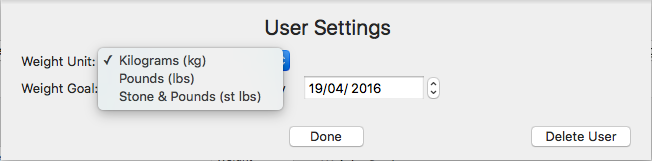
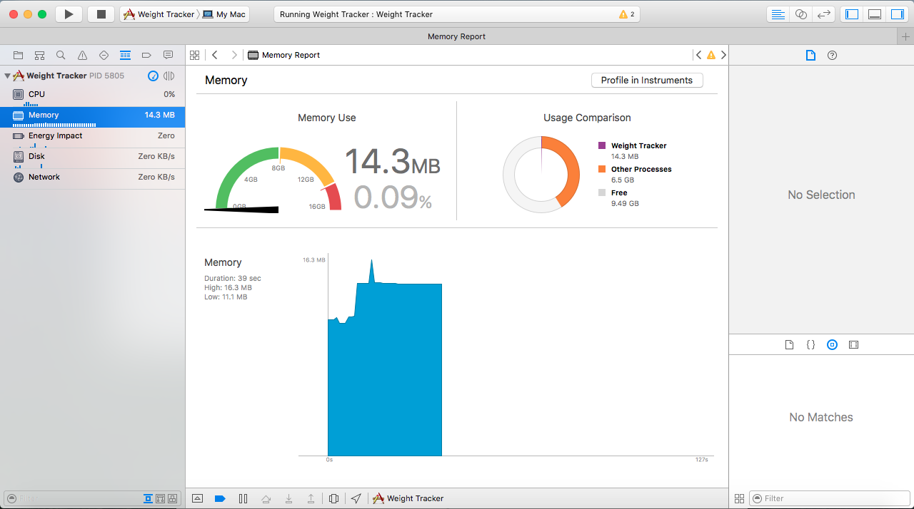
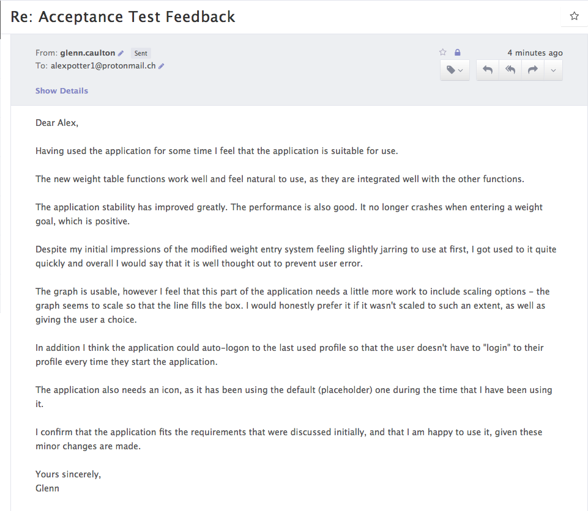

# Evaluation

## Evaluation of the application and objectives
From the Requirements Specification, the user wanted the application to do these things:

1. The system must have a method of inputting weight data over a specified period of time;

2. The system must be able to function with weight in measurement units of pounds, kilograms, as well as stones and pounds;

3. The system will have a means of providing visual feedback to the user via a graphical method;

4. The system must be able to handle multiple users, display their own separate profiles and manage the data associated with those profiles to persist even when the application is closed;

5. The system must launch and function effectively, without significant delays, hangs or crashes;

6. The system should be able to predict the user's eventual weight after the time period specified.

7. The system should be well designed, easy to use and simple in terms of navigation.

##### Evaluation of System Requirement 1
This requirement has been met as the function exists within the application - there is a weight table and the ability to add, remove and modify weight data. The table also accepts dates so that the user can use this to see progression of their data.
I would say that this was done as the user wanted - their main method previously of taking data was by using a paper-based table and I have replicated that into one of the core components of the application.

##### Evaluation of System Requirement 2

As this screenshot shows, the settings window allows for data to be manipulated with all three units, as the user requested. All of the calculations involving the data, such as the expected weight calculations, work well regardless of the unit.

The only thing that I would say is that there is a slight formatting error on the graph's labels for the data points in that the unit isn't added to the end of the weight value, but that is arguably a minor thing.

##### Evaluation of System Requirement 3

As this image shows, the graph is existent within the application. It could be improved, with scaling options in the unused space for example (as the graph defaults to scaling to fit the entire plot space and this may be unwanted), but it works and plots the data accurately, giving information about the data points via the use of labels.

I decided not to use axes on this graph as they did two things due to the size of the date intervals (as this was done in seconds, the value of even an interval of two or three days is very large):

* Lots of points were on the axes; this slowed down the application considerably, thus breaking System Requirement 5

* The axes sometimes were in the way of the data points and there were issues with scaling the graph when the axes were visible.

However, the requirement was to display visually the data that the user enters, and the graph meets that requirement.

##### Evaluation of System Requirement 4
The application was designed to handle multiple users from day one - the UI mockups show that the first screen the user meets is a profile selection screen.

Each profile's data is stored to a persistent database (NSUserDefaults) so that each profile is discrete and separate from the others, including the following:

* Weight data (dates and values)
* Weight goal (value and date)
* Weight unit selection
* Profile's name

I would therefore say that the application satisfies this requirement.

##### Evaluation of System Requirement 5
From my own experience on both the development environment and the target environment, the application runs reasonably well.

I decided to test how efficient the application was by using Xcode's built-in profiling tools to monitor CPU, RAM and Energy usage.

The image shows that the application on average used very little CPU resources. The fluctuation in use was 0% to 7%, and the 7% maximum occurred when the user profile was being loaded and the graph was being drawn.

In general, I would not expect this application to use more than 10-15% of the CPU even under extenuating circumstances.

In addition, the application also used very little RAM. When the application started, it used about 8MB of RAM and this would grow to a maximum of about 20MB of RAM when all of the data was loaded into memory. It is safe to say, therefore, that this application has virtually no impact on the system RAM, just using nearly 0.1% of the available RAM on the development machine on average and about 0.36% on the target machine on average. In fact, this application could be launched separately over 270 times before it would exhaust the 4GB of RAM on the target machine.

Despite the target machine being a desktop, and that for desktop computers energy efficiency is not a concern as much as on notebook computers, the energy use on average was very low - the CPU was transitioning from an idle state to a non-idle state at an average of 1 per second for my application, which is extremely low.

My application also uses Apple's App Nap technology which helps to minimise CPU and energy usage when the app is not in focus (such as when another window is covering it, or the user is not interacting with it).

Network and Disk usage was pretty much negligible also, with disk usage rising to 250 KB/s for a second or so when profile data was being accessed. Network usage remained at 0 KB/s for the entirety of the application's execution.

Whilst testing the application during the final stage of development, there were no crashes and no significant delays in processing - so in general, from the testing carried out, this application meets System Requirement 5.

##### Evaluation of System Requirement 6
The prediction of the user's weight became more accurate as development progressed, as it started as a simple percentage difference calculation to a more accurate linear regression calculation.

The expected weight is displayed in a central location in the application, on the main screen next to the weight table - this is arguably good as the user can see what their expected weight would be without leaving the weight table screen.

There are two points of improvement here though, I think:
* The prediction time is limited to only one week; there is no opportunity to change this.

* Linear regression may not actually be the most accurate regression curve for weight loss, as weight loss or gain actually tends to an exponential curve. Thus, to make the calculation more accurate I could use exponential regression rather than linear regression.

Overall though, the user can easily see a predicted weight value which was generally (during testing) in-line with expectations.

##### Evaluation of System Requirement 7
I decided to use Apple's human interface design guidelines to help me to design an application that conforms to the general style of OS X applications.

Using their APIs to design the app helped to create a sense of consistency with other apps that users would have installed on the system.

I tried to keep the number of separate windows to a minimum, and enforced a 'one window at once' idea so that no more than one window is displayed at one time. This is evidenced by the transition from selecting a user to the main screen. When the user clicks 'Continue', the first window closes and the second one opens. This was done to minimise redundant windows on the screen.

Where appropriate, I also made use of sheet-based alerts and windows (that slide down on top of a window) that are common in OS X applications. This again helped to create a sense of consistency, but it also allowed me to avoid creating modal-based 'pop-up' windows which could be considered annoying to users - especially those working on multiple displays.

I used only two tabs for the organisation of content on-screen - a tab for the graph view and a tab for the 'Information' view, which contains the weight table, weight goal and expected weight.

The top part of the window though is static and simply displays a message to the user on whether they will meet their weight goal, and also provides buttons to move to the settings window and back to the first window.

I would say that overall, the application is simple and very easy to use, so System Requirement 7 is satisfied.

## Acceptance test - client feedback
After the test, I sent an email to the client requesting a write-up of their feedback:

I received the following response:

The changes:

* Graph scaling options
* Auto-logon to last used profile
* Application icon

I subsequently identify that the client does wish there to be minor changes in the work, however it is likely that these changes will be made outside of the scope of this course due to a lack of time.

## Extensions
Whilst both the client and myself think that the application is well-suited to its purpose, it could be improved.

The client suggested that the profile selection screen should not appear every time but that the application should load the last profile that was loaded to both save time and mental effort.

Overall then, here is a summary of the good and bad points of the application:

| Positive aspects | Negative aspects |
| :------------- | :------------- |
| Application is relatively easy to use | Graph is limited in use - no scaling options |
| Designed nicely, is consistent with OS X style | Needs an actual icon |
| Stores data persistently, completely automatically and transparently | Cloud storage backup (e.g. iCloud, Dropbox, Google Drive) isn't present |
| Weight entry is easy to do | Date has to be entered manually, no 'calendar' like interface which is common |
| Application is small and runs well | Stored data is tied to machine, have to use Terminal to export data to another machine |
| Profile selection box is the first thing the user sees | Need to select profile every time app loads
